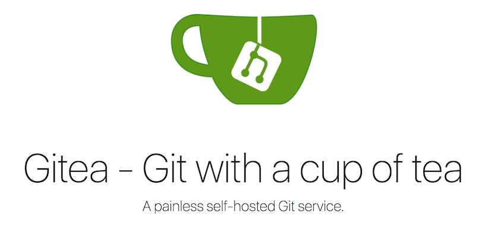

# Gitea的介绍

这是一篇流水笔记，没有什么实质的内容。

## 简介

`Gitea`是一款基于`Go`语言的轻量级自托管Git服务的开源软件。它可以帮助个人或团队搭建自己的Git仓库，管理代码、问题和文档等内容。

## 基本功能

1. 代码仓库管理：可以创建、克隆、合并、推送和拉取代码等操作。
2. 团队协作：支持多用户、权限管理、代码评审、问题跟踪和Wiki等功能，便于团队协作。
3. 安全性：支持用户认证、IP访问限制和二次验证等功能，保障仓库的安全性。
4. 多语言支持：支持多种语言的界面和文档，特别有中文文档，安装不再是问题。

## 官网地址

https://docs.gitea.io/zh-cn

## 其它

来自官方的`Gitea`与其它Git托管工具的对比，这里就不列入了，可以去官方看看：https://docs.gitea.io/zh-cn/comparison/ 。

总的来说，`Gitea`是一款轻量级、适合个人和公司、安装容易、系统要求低等特性，基本可以平替`GitLab CE`了。
