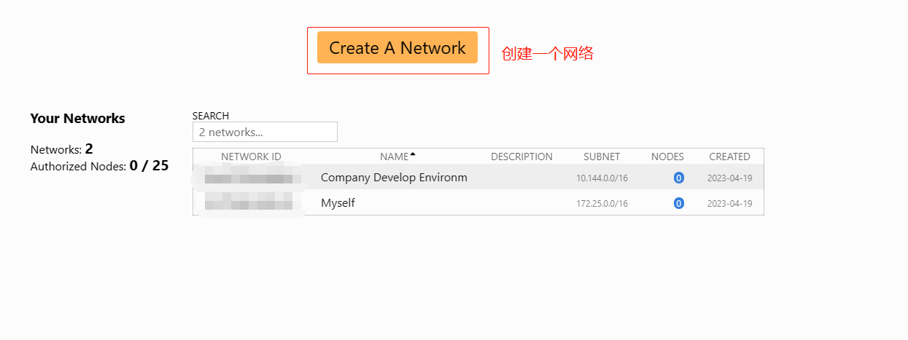

# ZeroTier的介绍与安装

## 前言

经常玩NAS的人基本上接触过这个玩意，我之前用的都是`FRP`这款内网穿透软件，后来经过同事的介绍和安利，让我非常有意愿想往`ZeroTier`转。这里先总结说下他们的区别：

| 产品  | 是否开源  | 公网服务器 | 
|------------|---------|-------|
| ZeroTier  | 是  | 非必须 |
| FRP       | 是  | 必须   |


## ZeroTier是什么？

`ZeroTier`是一款异地组网工具。每台服务器上只需要安装对应的客户端，连接到同一个网络，就可以实现 IP 互相访问。在此之上，还有自定义 DNS 服务器的功能，将通过 IP 这个步骤转换为通过域名进行访问，相当实用。

## 概念

### 客户端

所有的设备都是客户端，**连接方式是点对点**。在路由器下面的话是用`uPnP `的方式进行转发实现客户端到客户端的直接连接。如果 uPnP 没有开启，会通过传统的服务器转发的方式进行连接。

### Earth

根据其介绍，将地球上的所有设备连起来。那这里的Earth指的是就是整体的一个服务。

### Network

每一个`Network`包含的所有设备都是在同一个网络中。每一个网络都有一个`Network ID`。各个开黑缎通过这个ID连接到此网络。当然，一个账号是可以创建多个网络的。
网络分为`Public`和`Private`。一般我们自己组网是要用`Private`，需要在页面授权设备才可以进行访问。所以`Public`一般不太会有人用吧，毕竟任何人都可以随便进来。

### Planet

星球，指的是官方提供的服务器节点。各客户端都是通过这些服务相互寻址的。

### Moon

月球，指的是自定义的Planet。由于`ZeroTier`没有国内节点，在两个设备刚开始互连的时候有可能需要通过国外的节点寻址导致创建链接的速度偏慢。所以自建`Moon`可以提升速度。

### Leaf

客户端，指的是连接到网络上的每一个设备。据说`Moon`也是客户端的一种，只是没有额外功能，单纯用于连接的客户端。

## 支持的系统

* Windows
* MacOS
* Linux
* iOS
* Android
* FreeBSD
* Synology
* NAS Devices
* QNAP
* OpenWRT
* Docker

## 注册账号

通过[https://my.zerotier.com/login](https://my.zerotier.com/login)进入到登录或注册页面，可以通过Google、Github、Microsoft或邮箱方式注册或登录。非常简单。

## 创建网络

非常简单，只要点击【Create A Network】按钮就可以，没啥额外的配置就可以了。



## 客户端安装

### Windows

直接点击[ZeroTier One Latest](https://download.zerotier.com/dist/ZeroTier%20One.msi)就可以下载官方的Windows安装程序，安装过程非常简单。
官方也说了，如果是Windows 7或Windows Server 2012的话，请下载[ZeroTier One v1.6.6](https://download.zerotier.com/RELEASES/1.6.6/dist/ZeroTier%20One.msi)

### MacOS

支持`MacOS`系统为`10.13`以上。下载地址为[ZeroTier One Latest](https://download.zerotier.com/dist/ZeroTier%20One.pkg)

### Linux安装

根据官网给的说明，直接运行脚本即可。
```sh
curl -s https://install.zerotier.com | sudo bash
```
如果你安装了 GPG 密钥验证，用下面这条命令
```sh
curl -s 'https://raw.githubusercontent.com/zerotier/ZeroTierOne/master/doc/contact%40zerotier.com.gpg' | gpg --import && \ if z=$(curl -s 'https://install.zerotier.com/' | gpg); then echo "$z" | sudo bash; fi 
```
脚本会自动将 Zerotier 的源添加到 apt/yum 里并安装。 
安装好后，运行命令`sudo zerotier-cli join 你的网络ID`即可。

### Docker

用`docker-compose`构建，配置如下：

```yaml
version: '3.3'
services:
  zerotier:
    container_name: ZeroTier
    devices:
      - /dev/net/tun
    privileged: true
    image: zerotier/zerotier
    network_mode: host
    cap_add:
      - NET_ADMIN
      - SYS_ADMIN
    command: ['你的网络ID']
    volumes:
      - ./data/zerotier-one:/var/lib/zerotier-one
```

将上面的配置保存到`docker-compose.yaml`文件中，然执行命令`docker-compose up -d`就可以了。


> https://zhuanlan.zhihu.com/p/507274316