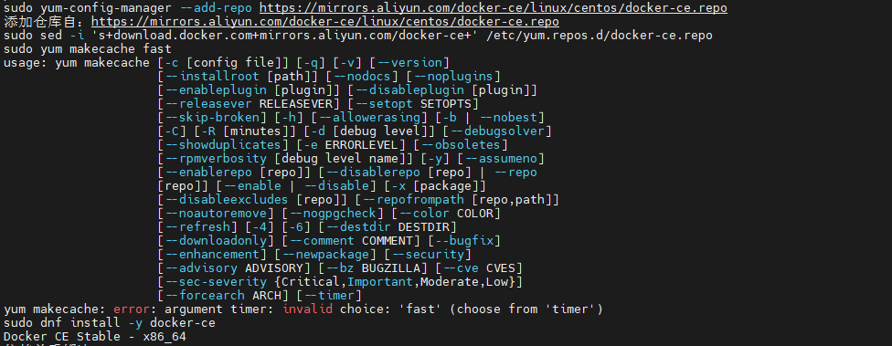

# Alma Linux 8 执行yum makecache fast error

今天的笔记内容简单，记录下因为`Alma Linux`的版本大变更导致的一些命令发生了变化。

在`Alma Linux 8`中安装Docker时，根据阿里云官方文档操作是，出现了如下错误：

```bash
yum makecache: error: argument timer: invalid choice: 'fast' (choose from 'timer')
```




`Alma Linux 8`跟`CentOS 8`基本相似，完全兼容，在`CentOS 8`之后命令已经改为`yum makecache`，而不再是`yum makecache fast`了。

操作系统每个大版本的更新，都会带来一定的变化，所以需要我们不断的记录技术的变化。