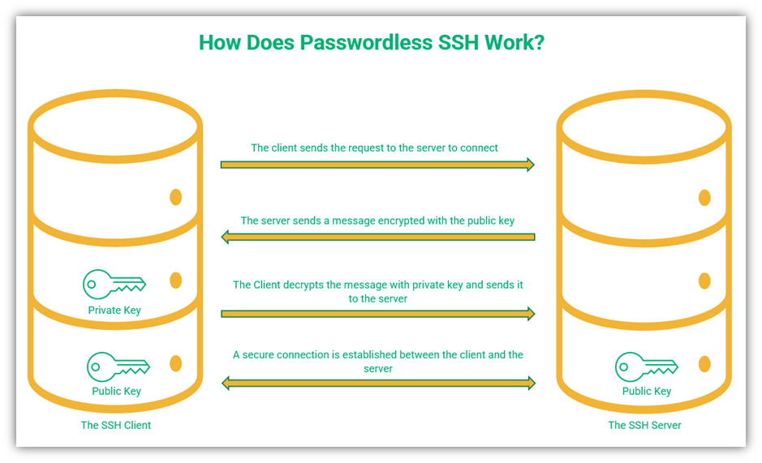

# Alma Linux免密登录

[toc]

## 实验环境

* A服务器 192.168.10.249
* B服务器 192.168.10.247

要求A服务器登录B服务器时无需输入密码。

## 免密登录原理

`SSH(Secure Shell)`是一种安全的远程登录协议，它使用了公钥加密，私钥解密的方式来验证用户，从而提高系统的安全性和用户方便性。具体的原理如下：

1. 用户在本地机器上生成一对公钥和私钥；
2. 用户将公钥上传到远程主机上；
3. 用户使用`SSH`客户端连接远程主机时，远程主机会生成发送一个随机数（称为challenge），同时用公钥将随机数加密向客户端回复；
4. 客户端使用本地机器上的私钥对`challenge`进行解密，然后将解密后的`challenge`发送到远程主机。
5. 远程主机会检查`challenge`是否匹配，如果匹配可以进行免密登录。
6. 建立了安全连接后，客户端和远程主机就可以使用SSH进行安全通信。



## 生成密钥

首先我们在A服务器执行下面的命令生成一对RSA密钥：

```bash
ssh-keygen -t rsa
```

部分执行如下所示：

```bash
[root@dev-web01 ~]# ssh-keygen -t rsa
Generating public/private rsa key pair.
Enter file in which to save the key (/root/.ssh/id_rsa):
Enter passphrase (empty for no passphrase):
Enter same passphrase again:
Your identification has been saved in /root/.ssh/id_rsa.
Your public key has been saved in /root/.ssh/id_rsa.pub.
The key fingerprint is:
SHA256:uMJ/xDeWn6Yqv6kpQoHAAZf6i9pfhk8aF3P/oz6SUnk root@dev-web01
The key's randomart image is:
+---[RSA 3072]----+
|+.o.             |
|.o.              |
|.o               |
|o .    .         |
| . .  +.S. .     |
|  o. . ==.E      |
| o .= *o =.o .   |
|..o .@o.+...=    |
|o .oo.=*==+=..   |
+----[SHA256]-----+
[root@dev-web01 ~]#
```

执行上面的命令时，我们直接按三次回车键（即采用了默认的配置），之后会在用户的家目录生成一个`.ssh`目录：

```bash
[root@dev-web01 ~]# ls -lrth ~/.ssh/
总用量 12K
-rw-r--r-- 1 root root  704 6月  19 16:36 known_hosts
-rw-r--r-- 1 root root  568 6月  19 17:29 id_rsa.pub
-rw------- 1 root root 2.6K 6月  19 17:29 id_rsa
```

* `authorized_keys`: 存放远程免密登录的公钥,主要通过这个文件记录多台机器的公钥。
* `id_rsa`: 生成的私钥文件
* `id_rsa.pub`: 生成的公钥文件
* `known_hosts`: 已知的主机公钥清单

## 发送公钥文件

### `ssh-copy-id`

这是最简单方便的配置方式，执行下面的命令就可以将公钥上传B服务器并写入到`authorized_keys`

```bash
ssh-copy-id root@192.168.10.247
```

部分执行打印如下所示：

```bash
[root@dev-web01 ~]# ssh-copy-id root@192.168.10.247
/usr/bin/ssh-copy-id: INFO: Source of key(s) to be installed: "/root/.ssh/id_rsa.pub"
/usr/bin/ssh-copy-id: INFO: attempting to log in with the new key(s), to filter out any that are already installed
/usr/bin/ssh-copy-id: INFO: 1 key(s) remain to be installed -- if you are prompted now it is to install the new keys
root@192.168.10.247's password:

Number of key(s) added: 1

Now try logging into the machine, with:   "ssh 'root@192.168.10.247'"
and check to make sure that only the key(s) you wanted were added.

[root@dev-web01 ~]#
```

### 手工复制

1. 首先将A服务器的公钥显示出来，然后用鼠标复制内容

  ```bash
  cat ~/.ssh/id_rsa.pub
  ```

2. B服务器检查有没有`.ssh`目录，如果不存在则新建目录

  ```bash
  mkdir ~/.ssh
  ```

3. B服务器追加内容

  ```bash
  echo "公钥内容" >> ~/.ssh/authorized_key
  ```

