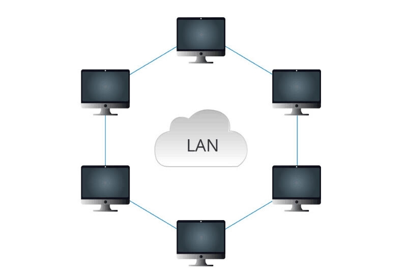

# 内网网段和LAN、WLAN概念区分

## 内网网段

内网网段一共分为三大类，这个只能记住啦：

* A类地址段：`10`段，后三位自由分配，即`10.0.0.0 ~ 10.255.255.255`；
* B类地址段，`172.16`段，后两位自由分配，即`172.16.0.0 ~ 172.16.255.255`；
* C类地址段，`192.168`段，后两位自由分配，即`192.168.0.0 ~ 192.168.255.255`；

大家基本上每个家里都有器，一般路由器用到的局域网IP地址段就是C类，比如常见的`192.168.1.1`。

## LAN 局域网

`LAN`的全英文名称为`Local Area Network`，翻译成中文意思`局域网`，有时候也成为`内网`，它的含义是：`在某一个区域内由多台计算机互联组成的计算机组，这些设备通过以太网电缆（网线）或WiFi连接起来`。比如一个家庭就是一个局域网，一个公司就是一个局域网，公司电脑可以连接到打印机就是通过局域网的。

## WAN 广域网

`WAN`的全英文名称为`Wide  Area Network`，翻译成中文意思`广域网`,它的涵义是：`指的是连接不同地区的局域网的计算机网络集合。`能够连接多个地区、城市和国家。

## 结束

今天这篇文章有点水，主要目的是为了记录局域网IP地址段有哪些，分别是什么，有时候我自己会忘记，所以老话说得好：好记性不如烂笔头。

其它的知识点只是顺带了下，真正要了解的话比较多，我们有个印象，大致能说的出来就可以了。
