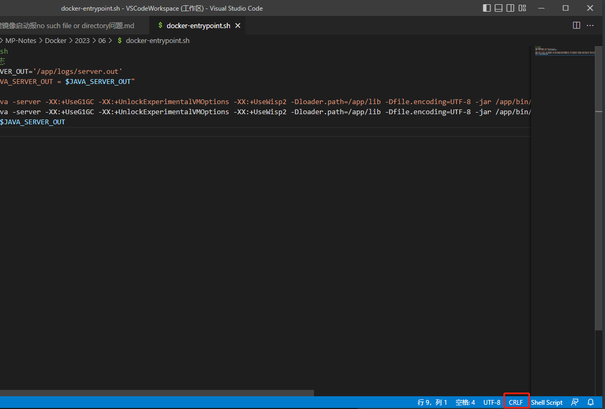
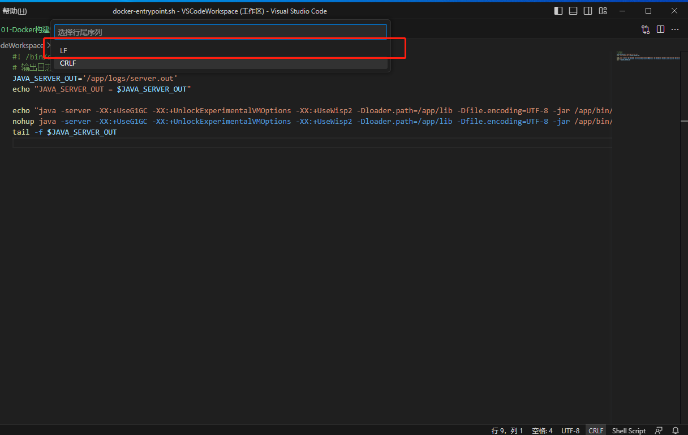

# Docker构建镜像启动报no such file or directory问题

[toc]

## 前言

这个问题困扰了许久，让人抓狂，同一份文件在A机器上没问题，但是到了B机器就出现了问题；更甚者在A机器前几天没问题，但是今天却出现了问题。出现的问题是启动镜像时会报`No such file or directory`。

## 原因分析

1. **文件路径错误**：你确实写错了路径，这个很好排查，仔细检查即可。
2. **文件不存在**：你指定的文件可能不存在，这个很好排查，仔细检查即可。
3. **权限问题**：如果文件的权限设置不正确，则可能无法访问文件。这个一般在Docker较少出现。
4. **操作系统不匹配**：这个极有可能时文件编码问题，下面展开来说。

## 文件编码有问题

出现这种比较恶心的情况，通常是因为我们写Dockerfile的入口脚本`entrypoint.sh`是在Windows系统下写的，这个是我之前一直忽略的问题。这个问题被忽略主要是编码肉眼不见，同时用`vim`软件查看也看不出什么毛问题。

这里就需要我们知道Windows和Linux的行结束符是不一样的，在Windows中，行结束符通常是由两个字符组成的：`\r\n`(回车符和换行符)。这个字符序列是由DOS操作系统引入的。在Linux中，行结束符通常只是一个字符：`\n`(换行符)。

当我们把在Windows系统下编辑好的文件传到Linux中，Linux无法识别隐藏的编码，造成Linux系统无法识别该文件。可以通过`cat -v entrypoint.sh`查看文件信息，如果命令中出现了`^M`则代表此文件是Windows系统编码，Linux不认识，就会报`No such file or directory`。

```bash
$ cat -v docker-entrypoint.sh
#! /bin/sh^M
# M-hM->M-^SM-eM-^GM-:M-fM-^WM-%M-eM-?M-^W^M
JAVA_SERVER_OUT='/app/logs/server.out'^M
echo "JAVA_SERVER_OUT = $JAVA_SERVER_OUT"^M
^M
echo "java -server -XX:+UseG1GC -XX:+UnlockExperimentalVMOptions -XX:+UseWisp2 -Dloader.path=/app/lib -Dfile.encoding=UTF-8 -jar /app/bin/app.jar --logging.file.path=/app/logs --server.port=8080"^M
nohup java -server -XX:+UseG1GC -XX:+UnlockExperimentalVMOptions -XX:+UseWisp2 -Dloader.path=/app/lib -Dfile.encoding=UTF-8 -jar /app/bin/app.jar --logging.file.path=/app/logs --server.port=8080 >> $JAVA_SERVER_OUT 2>&1 &^M
tail -f $JAVA_SERVER_OUT^M
```

## 如何修复

可以通过VSCode、Intellij IDEA等软件转换，同时也可以用这些软件检查文件是什么类型的编码。比如这里以VSCode软件为例，下面的`CRLF`则表示为Windows系统编码。



点击`CRLF`会弹出一个选项对话框，选择`LF`选项之后按回车就可以切换到Linux文件编码了，最后输入`Ctrl+S`保存就可以了。



## 总结

这个问题解决起来很简单，但是这个问题非常严重，因为会首次出线时根本不晓得原因。所以涉及到Linux的脚本文件、配置文件一定要注意编码问题。
