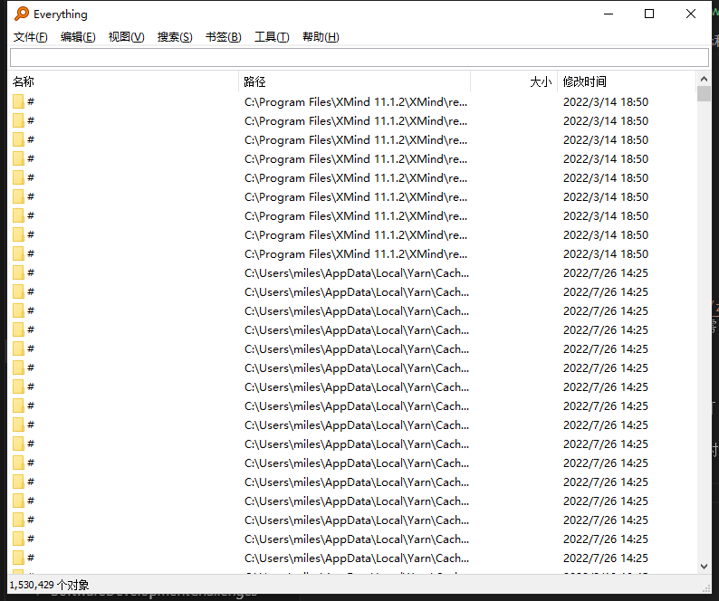
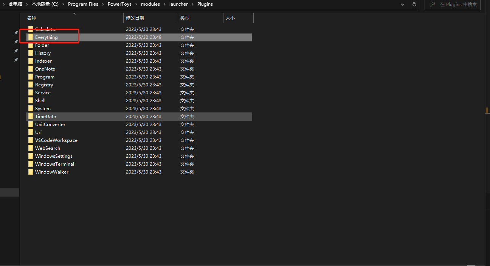
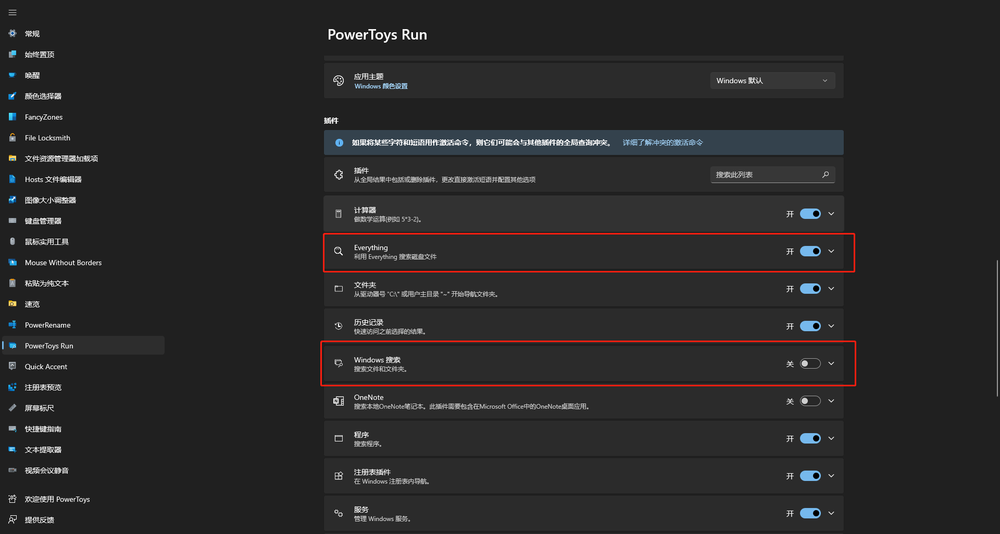
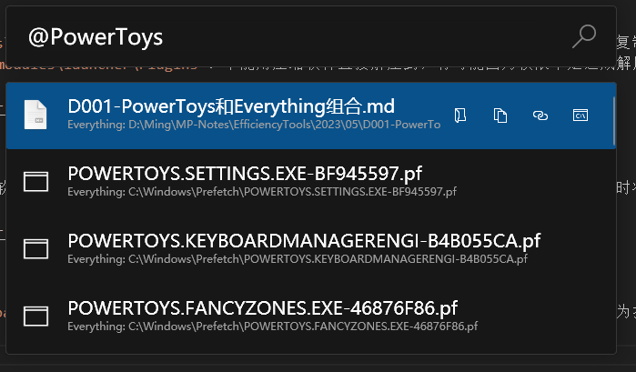

# PowerToys和Everything组合

[toc]

## 前言

在前一篇笔记中介绍了`Power Toys`这款软件，其中的一个小工具`PowerToys Run`，可以快速启动软件和搜索文件，但是我们都小的微软自带的`Windows Search`服务搜索整个盘是很慢的，所以市面上就有了`Everything`这款软件，如果`PowerToys Run`能和`Everything`那就非常强大了。

## `Everything`是什么？

`Everything`是`voldtools`开发的一款文件搜索软件，是一个运行于Windows系统，基于文件、文件夹名称的快速搜索引擎。`Everything`体积小巧，界面简洁易用，可以快速建立索引，快速搜索，同时占用极低的系统资源。

## `Everything`的特点

1. 用户界面简单
2. 快速索引
3. 快速搜索
4. 快速启动
5. 极少的资源占用
6. 实时更新
7. 支持中文
8. 只支持NTFS分区

## `Everything`的下载与安装

### 下载

可以直接去官网`https://www.voidtools.com/zh-cn/`下载最新版，下载地址也贴在这里了`https://www.voidtools.com/Everything-1.4.1.1024.x64-Setup.exe`。同样的，我会在阿里云盘存放一份，有需要的也可以直接去阿里云盘下载：`https://www.aliyundrive.com/s/jSpqyEcECYz`。

### 安装

这个软件的安装是非常容易的，只要下一步就可以，默认的设置已经完全满足了。

安装完成后启动`Everything`，第一次启动的时候会建立索引，扫描所有的盘符，这个耗时根据磁盘大小，文件和文件夹数量决定，不过一般十几秒就完成了。

然后就可以体验`Everything`的速度了，简直快的不得了。

**不能安装`Everything`精简版，不然下面的插件就不生效了。也不要安装便携版，不然需要自己配置。**

## 安装`Everything`的插件

将`Everything`整合到`Power Toys`，那么我们就不需要专门打开`Everything`用户界面了。

### 下载插件

首先我们需要去下载`Everything`的插件，插件官方地址在`https://github.com/lin-ycv/EverythingPowerToys`，可能部分同学们打不开或者加载巨慢，所以可以去云盘下载，地址为`https://url36.ctfile.com/d/14011336-56257611-abf0ea?p=6996 (访问密码: 6996)`。

### 安装

首先将`Power Toys`退出，然后把下载的`Everything-0.68.1-x64.zip`压解压至当前目录，然后将目录复制到`C:\Program Files\PowerToys\modules\launcher\Plugins`。不能用压缩软件直接解压到，有可能因为权限不足造成解压失败的。

### 检查

打开`Power Toys`软件，找到小工具`PowerToys Run`，检查插件列表中`Everything`是否为开启的，同时将`Windows搜索`这个插件关闭。

点击`Everything`插件，会展开支持的配置项，这里着重看到有一个【直接激活命令】，配置的值为`@`，在下面使用的时候就会用到。

## 如何使用

通过快捷键`Alt+Space`调出`PowerToys Run`，需要使用`@`为开头，这个表示使用`Everything`插件作为搜索结果。

** 当然我们可以不用输入`@`，也会用到用到这个插件，只不过`Everything`插件的搜索结果会排序在后面，这个也可以在插件中配置顺序，同学们可以自己去研究了。

## 个人使用感受

整体用起来跟`Everything`软件还是优点差距的，不过整体已经非常棒了。推荐大家安装捣鼓。