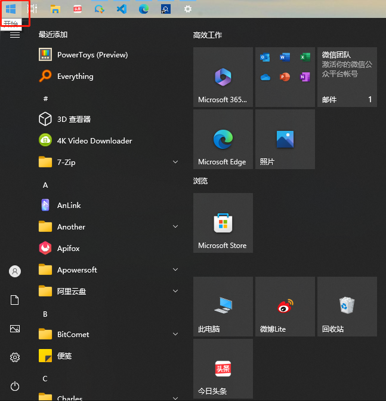
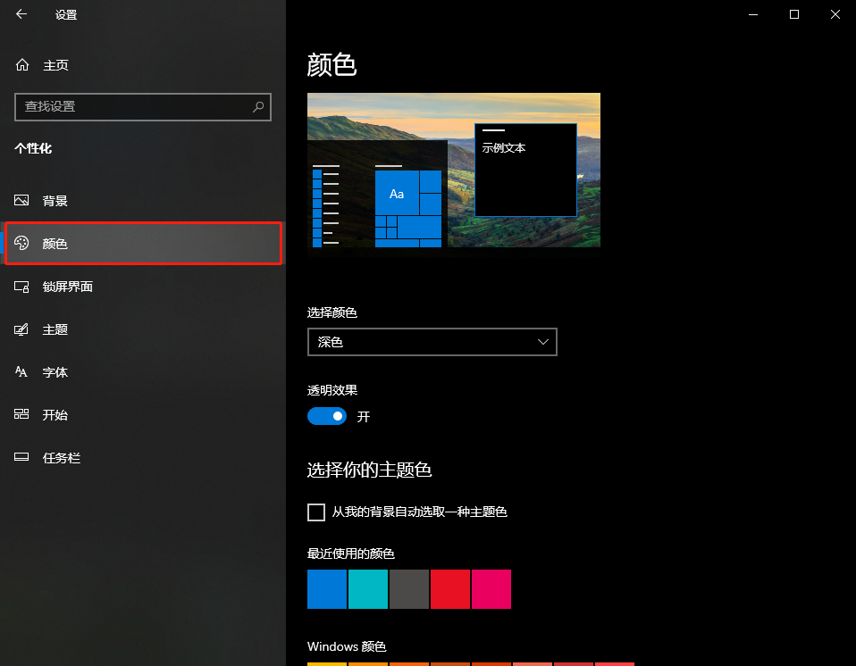

# Windows10、Edge自动切换深色模式（黑色模式）

[toc]

## 前言

深色模式有的地方叫做黑色模式、暗黑模式、夜间模式，其英文名叫做`Dark Mode`，无论哪种叫法，其定义都是相同的：专注于内容本身，系统对所有屏幕内的视图、菜单和控件使用较暗的调色板。

我个人是比较在晚上的时候使用深色模式，包括我的Android手机也是采用深色模式的。至于深色模式是否对护眼，个人并没有去研究哈，只是个人在晚上使用白底眼睛受不了。

## Windows10版本要求

必须是Windows v1809、v1903、v1909和等高版本才支持调整。那如何查看我们的系统支付支持呢，下面介绍两种比较快速的方法

### 一个命令`winver`

1. 通过【Windows+R】快捷键打开【运行】

  

2. 输入`winver`命令，然后点击【确定】即可查看

  

3. 查看当前版本

  

### 点几下，也快的

1. 通过【Windows+X】快捷键打开快捷操作菜单

  

2. 选择【系统】菜单即可查看

  

3. 查看当前版本

  

## 配置深色模式

1. 前往【开始】菜单 → 【设置】菜单 → 【个性化】 → 【颜色】

  

  我的开始菜单在左上角，一般都在左下角，我自己调整了下。

  

  

  

2. 然后再颜色的配置界面中选择【深色】，以打开深色模式

  

至此我们成功配置了黑色模式。

## 通过软件实现自动切换

上面的配置不支持到点自动切换，用起来比较麻烦，所以我们通过借助软件实现自动切换，这样就可以达到白天用白色，晚上用深色。

软件名`Auto Dark Mode X`，官方地址在`https://github.com/AutoDarkMode/Windows-Auto-Night-Mode`，软件同时在云盘也有同步，麻烦大家关注下公众号，然后回复【DarkMode】关键字就可以获取下载地址了，感谢哈。

### 安装

安装的过程中有几个点稍微提一下，本身软件的安装过程非常简单的。

* 安装的的一开始有一个提示：“请选择安装模式”

  

  意思就是这个软件就是当前用户用还是所有用户都可以用。默认第一个就好，我们一般没有那么多的用户。

* 安装过程中的语言选择

  

  下拉不支持中文，那就选择英文就好了。软件本身支持中文的。

### 配置支持中文

软件安装成功后默认是英语的，需要自己手动修改下。

1. 打开软件，点击【settings】菜单

  

2. 会看到【Language】选项，下拉选择【简体中文】

  

  

3. 软件重启

  

### 配置生效时间

1. 点击【时间】菜单，我们会看到好几个选项，个人在用的方式是选择【Follow Windows night light】

  

2. 点击【Open night light settings】 按钮
  
  

3. 在【计划】一栏中，点击按钮由【关】改为【开】状态

  

  

4. 至此就可以了，看效果需要等待日落的时候。

## Microsoft Edge如何开启夜间模式

1. 打开Edge浏览器，打开一个新的标签页，输入地址`https://microsoftedge.microsoft.com/addons/Microsoft-Edge-Extensions-Home?hl=zh-CN`。将会打开Edge浏览器的扩展

  

2. 在输入框中输入`Dark Reader`内容，并且按下【Enter】键

  

3. 在搜索的结果中，第一个应该就是我们的要找的插件，如果不是请对比下图，然后点击【获取】按钮

  

4. 在弹出的对话中，点击【添加扩展】按钮，等待一会儿就完成了。然后找一个页面就会看到效果啦。

  

## 软件获取

1. 点下面的小卡片，关注下公众号

2. 关注后在对话框内容发送：DarkMode 获取下载地址。

https://www.aliyundrive.com/s/guZqP7YibWk