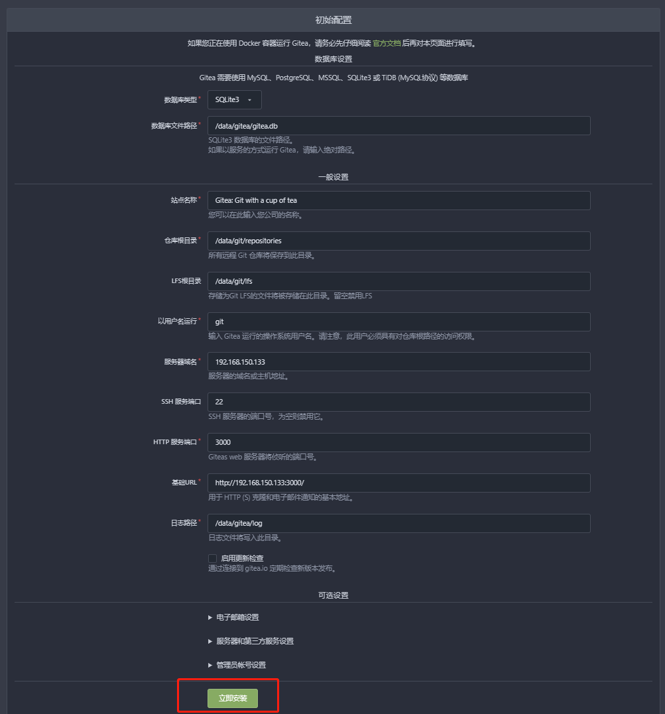
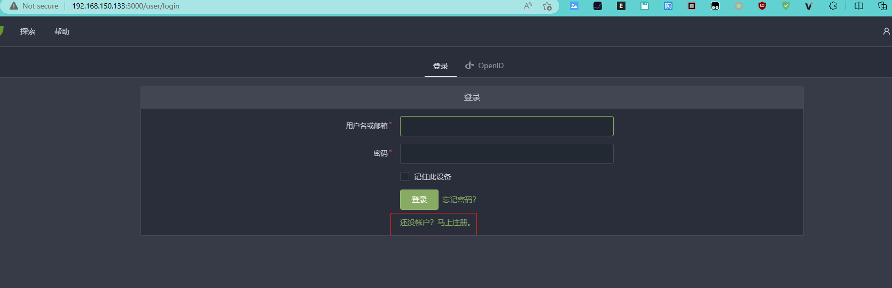
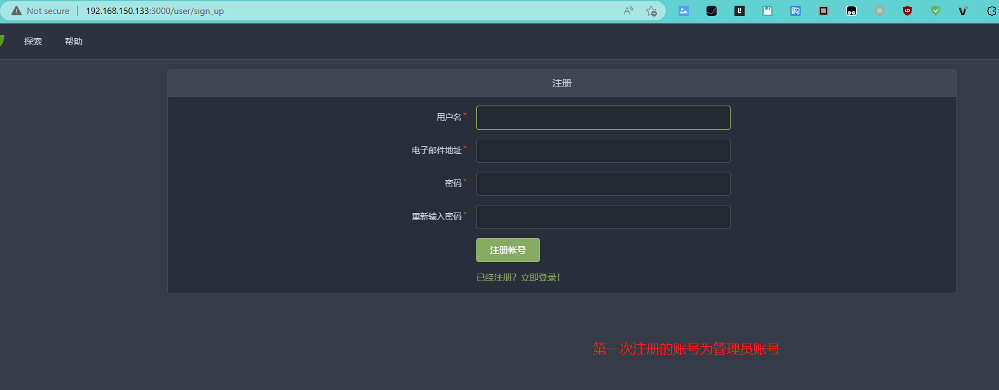

# 用Docker安装Gitea（简单体验）

这篇笔记主要记录的是简单安装`Gitea`，也就是跑起来用用看，如果决定用于公司团队的话，应该有更多的配置或自定义项。

## 准备工作

需要在自己的电脑上安装`Docker`。`Docker`是一个开源的容器化平台，可以帮助我们快速部署和运行应用程序。具体如何在`Windows`或`MacOS`安装`Docker`，可以查看我之前的笔记或网上搜索下吧。

## 下载镜像

输入下面的命令来下载`Gitea`的`Docker`镜像。

```sh
docker pull gitea/gitea:latest
```

## 启动容器

为了简单体验，所以尽量简化命令，我们可以使用下面来创建`Gitea`容器：

```sh
docker run -d --name=my-gitea -p 3000:3000 -p 222:22 gitea/gitea:latest
```

稍微啰嗦下各个参数的含义，`-d`表示后台运行容器，`--name`表示为容器命名，`-p`表示将容器的端口映射到主机的端口上。比如`-p 222:22`则表示将容器的22端口映射到主机的222端口上。

3000是`Gitea`的Web界面端口；22是`Gitea`的SSH端口。

## 初始化

1. 安装

    容器创建完成后，`Gitea`就已经启动成功，速度非常的快（GitLab就...），然后我们可以在浏览器中输入`http://服务器IP地址:3000`来打开`Gitea`的Web界面。在首次访问时，`Gitea`要求我们进行一些基本配置，这里直接点击【立即安装】按钮就可以了。不做过多的配置了。

    
2. 注册账号，这个账号即为管理员账号

    
    

总之，使用 Docker 安装 Gitea 非常简单，只需要几行命令就可以快速部署和运行 Gitea。在使用 Gitea 进行开发时，需要注意保障仓库的安全性和稳定性，以保障自己和团队的代码和数据。