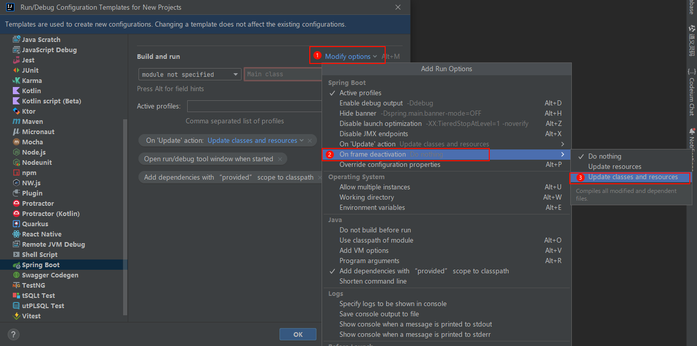

# Intellij IDEA插件，提高效率

工欲善其事必先利其器，借助工具能帮助我们提高开发效率，本次分享的是个人在用的`IDEA`插件，不是各种插件的推荐。

## 环境介绍

`IDEA`插件具有时效性，不同的时期的的插件处理方式不同，所以这里特别列出每个插件的版本（特别是破姐的）。

| 名称                | 版本            | 简介            |
| ------------------- | --------------- | --------------- |
| Intellij IDEA       | 2022.2.4 UE     |IDEA的版本|
| Codeium AI          | 1.2.61          |AI编程助手|
| TONGYI Lingma       | 1.0.8           | AI编程助手            |
| JRebel and XRebel   | 2023.4.2        | 项目热部署            |
| Maven Helper        | 4.27.1 | Maven依赖冲突分析神器 |
| Smart Input         | 4.4.3          | 中英文自动切换        |
| MyBatisCodeHelperPro | 3.2.7           | Mybatis的工具         |
| String Manipulation | 9.7.1           | 字符串工具            |
| Translation | 3.6.1 |翻译|

以上就是我在用的插件，当然`IDEA`有很多其它优秀的插件，因场景和业务限制同时安装更多的插件会让`IDEA`越来越占用内存，所以在插件上我会克制。废话不说，下面开始介绍每个插件的安装、作用和基本使用方式。

## Maven Helper

### 简介

`Maven Helper`是`IDEA`中`Maven`依赖冲突分析利器，此插件可用通过图形界面的形式显示maven依赖树，可以很方便看出不同版本`jar`的源头。

### 安装

直接去`IDEA`的插件中心搜索`Maven Helper`，点击`install`按钮安装插件，安装完成后需要重启IDEA。

### 使用

当`Maven Helper`插件安装成功后，打开项目中的`pom.xml`文件，就会多出一个`Dependency Analyzer`视图：

切换到此视图即可进行相应的操作：

* `Conflicts`：查看项目的依赖冲突。
* `All Dependencies as List`：以列表形式查看所有依赖，同时右侧还有一个搜索框，可以根据索索的内容过滤
* `All Dependencies as Tree`：以树形形式查看所有依赖，同时右侧还有一个搜索框和`Filter`选项，需要勾选`Filter`后，搜索框才能生效。

#### 冲突演示

我这里故意引入了`slf4j-api`不同版本，`Maven Helper`的`Conflicts`就会显示出一个依赖冲突了，具体如何解决冲突视情况而定。

#### jar搜索过滤

比如我想要搜索依赖名称含`log`的：

## IDE Eval Reset

### 简介

`IDE Eval Reset`可以将IDEA的部分插件产品无限试用，老版本的IDEA该插件也支持无限试用。

### 安装

1. 路径在`Settings` → Plugins` 这个界面后有一个设置图标，如下图所示：

2. 然后点击`Manage Plugin Repositories...`，在弹出的对话框中点击`+`：

3. 将`https://plugins.zhile.io`添加：

4. 搜索：`IDE Eval Reset`插件进行安装

5. 插件会提示安装成功

## Smart Input

### 简介

该插件核心功能可以根据输入位置的上下文分析当前处于什么场景应该使用哪种输入法并自动切换，而且还可以通过光标的颜色来提醒当前是什么输入法。

### 安装

直接去`IDEA`的插件中心搜索`Smart Input`，点击`install`按钮安装插件，安装完成后需要重启IDEA。

安装完成后需要重启IDEA。

 

### 配置

打开`Settings` → `Smart Input` → `基础配置`，主要是配置下自己使用的中文输入，其它的默认选项就可以了。

### 感受

本插件可能在部分场景下不支持，这个时候插件判断错误导致使用起来不舒服，可以在插件配置项配置**主动切换输入法后**为**锁定自动切换知道下次主动切换输入法**。

在忘记切换输入法的时候该插件作为替补是非常丝滑的。

该插件建议及时更新到最新版本，应该会适配更多场景。

### TONGYI Lingma

### 简介

通义灵码，是阿里云出品的一款基于通义大模型的智能编码辅助工具，提供行级/函数级实时续写、自然语言生成代码、单元测试生成、代码注释生成、代码解释、研发智能问答、异常报错排查等能力，并针对阿里云 SDK/OpenAPI 的使用场景调优，助力开发者高效、流畅的编码。

> `IDEA`官方出品的`AI Assistant`插件，国内特供版根据新闻正在和阿里通义大模型合作。

### 安装

直接去`IDEA`的插件中心搜索`TONMGYI`，点击`install`按钮安装插件，安装完成后需要重启IDEA。

### 配置

重启之后，右下角有插件的提示，要求登录阿里云，没有的话可以用淘宝、支付宝、钉钉联合登录就可以用了。

### 感受

目前用的时间还不是很久，一般的提示还可以的。

## Codeium

### 简介

`Codeium`是一款免费的AI编程助手，类似于`Github Copilot`，在免费中的AI提示中应该算是比较好的了，而且无需魔法就可以使用的。

在免费的AI编程助手中，我个人觉得`Codeium`比`aiXCoder`、`Tabnine`、`AWS Toolkit`都更加优一点。

至于`Codeium`和`TONGYI Lingma`哪个更加优秀还需要使用一段时间才能对比出效果。

### 安装

直接去`IDEA`的插件中心搜索`Codeium AI`，点击`install`按钮安装插件，安装完成后需要重启IDEA。

### 设置

`Codeium`需要联网并需要登录，在`IDEA`下面有一个如下图所示：

可以使用Google账号或则新建一个账号登录即可。

### 感受

`Codeium`能根据你的注释、方法名，上下文等给出提示，有时候很准确，有时候就不相干，总体还是愉快的玩耍。

## JRebel and XRebel

`IDEA`自带的热部署能力很弱，在方法内做一些简单的修改是可以生效的，但是较为复杂的变动（比如增加了字段，改了数据类型...）自带的`IDEA`热部署就无能为力了，这个时候`JRebel and XRebel`就显示出其NB的地方了。

### 简介

`JRebel `是一款JAVA虚拟机插件，它使得我们开发者能在不重启服务的情况下，“实时”的看到代码改变的效果。`JRebel `使我们能即时看到代码、类和资源的变化，从而跳过了构建和部署的过程，可以省去大量的部署时间。

`XRebel `是不间断运行在Web应用的交互式分析器，当发现问题时会在浏览器中显示告警信息。

> 本次着重介绍的是`JRebel `。
>
> 我认为`JRebel `应该是处理热部署最好的插件了。

特别注意：本次介绍的包含破姐，注意自身环境是否可用，如果不可用有要么购买许可证，要么放弃使用。

### 安装

直接去`IDEA`的插件中心搜索`JRebel`，点击`install`按钮即可，这俩货是绑定在一起下载的。

该插件安装后是免重启`IDEA`的。

### 魔法

该插件非常强大，但是收费的，所以我们需要对插件特别处理。`JRebel `插件不需要随意升级，因为每个版本的魔法是不一样的，这里我安装的版本是`2023.4.2`。

1. 下载代理`ReverseProxy-v1.4`，注意选择对应版本下载，然后双击打开就可以了。

   `https://github.com/ilanyu/ReverseProxy/releases/tag/v1.4`，如果打不开该地址，下面的地址可免魔法：

   * Windows X64 `https://mirror.ghproxy.com/https://github.com/ilanyu/ReverseProxy/releases/download/v1.4/ReverseProxy_windows_amd64.exe`
   * MacOS `https://mirror.ghproxy.com/https://github.com/ilanyu/ReverseProxy/releases/download/v1.4/ReverseProxy_darwin_amd64`

   

2. 重新打开Setting对话框，点击`Settings` → `JRebel and XRebel` → `Activate now`。

   

3. `Team URL`输入地址`http://localhost:8888/{GUID}`，其中`GUID`就是`UUID`，可以在线生成：`https://www.guidgen.com/`

4. `Email Address`随便写，只要符合邮箱格式就可以。

5. 然后点击`Activate`就可以。

   

### 设置`JRebel`

#### 1、设置离线工作模式

点击`work offline`就会变成离线工作模式，同时配置`Offline seat duration`的值为`15`，这样不用一直开启代理工具。

如果离线过期了，只需要再次启动`ReverseProxy`，激活续期就可以了。

#### 2、设置项目自动构建（非必须）

我这里以`Spring Boot`项目启动为例，配置项目自动编译，其路径在`File` → `New Projects Setup` → `Run Configuration Templates...`  →`Spring Boot`

配置On'Update' action

配置On frame deactivation

以上的配置仅针对新的项目，如果已经存在的项目，需要在项目的`Run` → `Edit Configuration...`，后面的配置是一样的。

### 启动JRebel

之前都是用`IDEA`自带的`Run`、`Debug`启动项目的，我们称之为原生启动，现在需要用`JRebel`启动：`Rebel Run`、`Rebel Debug`。

在启动项目的时候，`JRebel`也会提示是否启用`JRebel: enable automatic save and compilation?`，我们需要选择启用。

### 检查效果

比如在`Controller`增加了一个接口，只需要编译（等待或手动按键`Ctrl+Shift+F9`）该类接口就可以使用了，而且`Swagger`都可以刷新出来。

## MyBatisCodeHelperPro

### 简介

该插件功能提供了XML和Mapper的互相跳转、以及在XML中变量的提示、SQL日志的处理。

### 安装

直接去`IDEA`的插件中心搜索`MyBatisCodeHelperPro`，点击`install`按钮即可，也可以先下载 https://plugins.jetbrains.com/plugin/20575-smart-input，然后从本地安装。

安装完成后需要重启IDEA。

### 配置

该插件部分免费部分已经足够使用了，所以可以不需要破姐。

### 感受

1. XML和接口互相跳转

   

2. SQL日志

   

## String Manipulation

### 简介

该插件是针对字符串处理的，提供的功能非常多，需要自己摸索了。

### 安装

直接去`IDEA`的插件中心搜索`MyBatisCodeHelperPro`，点击`install`按钮即可。

### 配置

功能非常多，这里不展开了。

### 感受

其实个人用的不多。

## Translation

### 简介

该插件提供了翻译和替换。

### 安装

直接去`IDEA`的插件中心搜索`Translation`，点击`install`按钮安装即可。

### 配置

可以配置翻译源。

### 感受

还可以，支持OpenAI，但是如何让它理解上下文去翻译是个问题。

