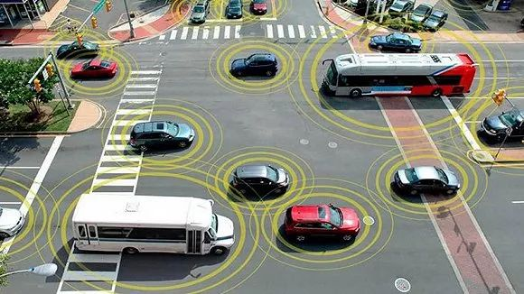

# 什么是NB-IoT？

[toc]

`NB-IoT`是一种新兴的物联网技术，是一种低功耗广域网技术，专门为物联网应用而设计。它可以提供低成本、低功耗、长距离、广覆盖和高可靠性的网络连接，使得物联网设备能够更加智能化、互联互通，具有广泛的应用场景。本文将了解什么是NB-IoT以及它的特点、应用场景。

## 什么是物联网

物联网是一种通过互联网连接各种物理设备和物品，实现设备之间胡同和数据共享的技术和概念。简单点来说，物联网就是将各种智能设备、传感器和物品连接到互联网上，让它们能够互相通信、自动控制和协同工作。2005年，国际电信联盟（ITU）首次提出了“物联网”的概念，并将其定义为“无线传感器和互联网的融合，用于实现人机交互、物物互联和物物协同的全球网络”。

我们很长一段时间都在解决提高人与人之间通信的效率，于是有`1G`，`2G`，`3G`，`4G`等技术，而且随着智能手机的广泛普及，我们的通信技术已经从最早的电报到现在的音频、视频，技术手段已经十分强大。于是那些大佬们在想着**人与人之间进行通信的网络（人联网）**的增长点已经发展的差不多了，所以需要有新的需求刺激，那么**物与物之间进行通信的的网络（物联网）**就提上日程了。

但是这个方案提出还确实非常有好处，举几个场景来看看他们的作用：

* 家里的所有设备都联网了，那就实现随时控制、远程控制，还可以实现场景定义，比如人离家后电器、灯光等自动断电等。

  

* 所有汽车联网，那么就可以实现自动驾驶、自动探测是否有人，可以降低车祸事故。

  

## NB-IoT和LPWAN

我们从前面的概念也得知，物联网其实很早就提出来了，随着无线技术的发展，就有了**WLAN物联网**，其意思就是无线局域网的物联网，是一种覆盖范围较小的物联网络。Wi-Fi、蓝牙、Zigbee、Z-wave等技术都是WLAN物联网的代表。

但这些技术并不适用于物品，因为物联网关注的技术指标和人联网关注的技术指标不一样：

* **速度**：物联网并不需要很高的带宽，而人联网则相反
* **功耗**：物联网要求低功耗，不然设备维护简直不敢想象
* **覆盖**：可以适应各种情况，比如农村、厂房、地下室等
* **成本**：低成本才可以进行大面值的安装推广

## `LPWAN`

由于WLAN物联网主要受限于覆盖范围和功耗上，于是`LPWAN`这个概念被提出来了。`LPWAN`的全称为`Low Power Wide Area Network`，中文意思就是**低功耗广域网**，`LPWAN`也叫做蜂窝物联网。

`LPWAN`物联网也是包括很多技术标准，目前比较主流的有：`NB-IoT`，`eMTC`，`LoRa`，`Sigfox`。

## `NB-IoT`

`NB-IoT`的英文全称为`Narrow Band Internet of Things`，中文意思为`窄带宽物联网`。是一种窄带低功耗无线通信技术，是`3GPP`组织在`4G LTE`标准基础上推出的。它采用窄带调制方式，支持大规模的低功耗物联网连接，可以提供广域覆盖和深室内覆盖，具有低成本、低功耗、长距离、广覆盖和高可靠性等特点。

`NB-IoT`技术的主要特点包括：

1. **低成本**：`NB-IoT`技术采用窄带通信技术，相比于传统的带宽通信技术，可以降低硬件成本和维护成本。同时，`NB-IoT`技术还支持多个设备共享一个基站，可以进一步降低网络部署成本。
2. **低功耗**：`NB-IoT`牺牲了速率，却换回了更低的功耗，可以最大限度地节省设备的能耗，提高设备的续航能力。同时，`NB-IoT`技术还支持设备休眠和唤醒，可以进一步降低设备的能耗。
3. **广覆盖**：`NB-IoT`有更好的覆盖能力（20dB增益），所以室内、井下等都可以覆盖。
4. **长距离**：`NB-IoT`技术采用窄带调试方式，可以实现长距离传输，支持超过10公里的远距离通信。
5. **高可靠性**：`NB-IoT`技术采用多路径传输，能够抵御多种干扰和噪声，提高信号的稳定性和可靠性。

## NB-IoT的应用场景

`NB-IoT`技术具有广泛的应用场景，可以应用于智能家居、智能能源、智能交通、智能城市等领域。

1. 智能家居：`NB-IoT`技术可以实现智能家居设备的互联互通，包括智能门锁、智能家电、智能照明等设备。通过`NB-IoT`技术，这些设备可以实现远程控制、状态监控、数据统计等功能，提高家具的智能化程序。
2. 智能能源：`NB-IoT`技术可以应用于能源领域，包括智能电表、智能燃气表、智能充电桩等设备。通过`NB-IoT`技术，可以实现远程检测和控制，提高能源的利用率和安全性。
3. 智能交通：`NB-IoT`技术可以应用于交通领域，包括智能车载设备、智能交通信号灯等设备。通过`NB-IoT`技术，可以实现车辆联网、交通信号协调等功能，提高交通的效率和安全性。
4. 智能城市：`NB-IoT`技术可以应用于城市领域，包括智能公共设施、智能环境监测等设备。通过`NB-IoT`技术，可以实现城市设施的智能化管理和检测，提高城市的智能化和可持续发展水平。
5. 其它更多：商业金融， 制造业，医疗行业等

