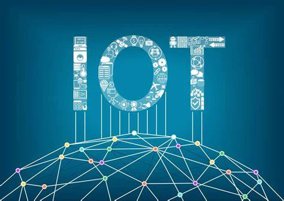

# 物联网的主要通信协议

[toc]

物联网的通信协议有很多种，下面列举一些主要的通信协议，简单了解下他们的定义、优缺点。

## MQTT

`MQTT`是`Message Queuing Telemetry Transport`的缩写，是一种轻量级的发布订阅消息传输协议。`MQTT`协议是轻量、简单、开放和易于实现的，这些特点使得它使用范围非常广泛。它可以在传输层和应用层之间提供一个可靠的传输协议，支持点对点和一对多的通信。

**优点**

* 开销小
* 适应低带宽和不稳定网络
* 实现简单

**缺点**

* 不支持数据存储和查询

**应用举例**

* Amazon IoT

## CoAP

`CoAP`是`Constrained Application Protocol`的缩写，是一种专门为物联网设计的应用层协议，采用`RESTful`架构，服务端的资源地址和互联网一样也有类似URL的格式，客户端同样有POST、GET、PUT和DELETE方法来访问服务端。适用于低功耗和低带宽的设备。它可以通过UDP传输协议进行通信，支持可靠传输和非可靠传输，同时具有低开销和高效率的特点。

`CoAP`是二进制格式的，HTTP是文本格式的，所以`CoAP`比HTTP更加紧凑。

**优点**

* 低功耗
* 低带宽
* 轻量化，CoAP最小长度仅仅4B，而一个HTTP的头都有十个B了
* 支持可靠传输，数据重传，块传输
* 支持IP多播，及可以同时向多个设备发送请求

**缺点**

* 不支持数据存储和查询

**应用举例**

* Philips Hue智能灯泡
* Nest智能恒温器

## HTTP

`HTTP`是`HyperText Transfer Protocol`的简称，是一种基于请求响应模型的应用层协议，适用于互联网和局域网环境。它可以通过TCP传输协议进行通信，支持可靠传输和非可靠传输，同时具有广泛的应用和易于实现的特点。

**优点**

* 广泛应用
* 易于实现
* 支持数据存储和查询

**缺点**

* 开销大
* 服务端无法主动通知客户端
* 成本高

**应用举例**

* Apple HomKit

## DDS

`DDS`是`Data Distribution Service`的简称，是一种实时数据传输协议，适用于分布式实时系统。它可以通过TCP/UDP传输协议进行通信，支持可靠传输和非可靠传输，同时具有高度的可靠性和实时性。

**优点**

* 实时数据传输
* 高度的可靠性
* 支持数据存储和查询

**缺点**

* 开销大
* 成本高

**应用举例**

* NASA国际空间站
* 智能电网

## LoRa

`LoRa`是一种长距离低功耗无线网络协议，适用于广域物联网。它可以通过无线信道进行通信，支持可靠传输和非可靠传输，同时具有低功耗和长距离传输的特点。

**优点**

* 远距离（城镇2~5KM，郊区15KM）
* 低功耗
* 安全（AES128加密）

**缺点**

* 传输速度慢
* 传输容量较小
* 不可接入互联网

**应用举例**

* 智能城市
* 智能农业

## ZigBee

`ZigBee`是一种低功耗无线网络协议，适用于局域网物联网。它可以通过无线信道进行通信，支持可靠传输和非可靠传输，同时具有低功耗和自组织网络的特点。

**优点**

* 低速
* 低耗电
* 低成本
* 支持大量节点（最多65000个）
* 自组网

**缺点**

* 不可接入互联网
* 短距离（10到100米）
* 穿透性差

**应用举例**

* 智能家具（小米）

## NB-IoT

`NB-IoT`的英文全称为`Narrow Band Internet of Things`，中文意思为`窄带宽物联网`，使用180kHz的载波传输带宽。可以直接部署于GSM网络（2G）、UMTS网络或LTE网络（4G）。

**优点**

* 远距离（10KM）
* 低耗电
* 低功耗
* 可接入互联网
* 移动性强

**缺点**

* 需要基站支持
* 某些地区无信号

**应用举例**

* 智能家具（小米）

## LwM2M

`LwM2M`的英文全称为`Lightweight Machine-To-Machine`，是一种基于`CoAP`协议的物联网设备管理和监控协议，旨在为设备提供一种轻量级、安全可靠的通信方案。

**优点**

* 协议是轻量级的
* 安全可靠
* 灵活可扩展，支持灵活的数据模型定义和扩展。

**缺点**

* 实现和集成相对复杂

**应用举例**

* 智能城市
* 智能家居
* 工业自动化
* 智能停车场
* 智能垃圾桶

## TCP

`TCP`的英文全称为`Transmission Control Protocol`，是一种面向连接的、可靠的、基于字节流的传输层通信协议。

**优点**

* 面向连接
* 可靠通信
* 基于流的形式

**缺点**

* 花销大
* 功耗大（设备必须时刻保持连接状态）
* 消耗时间比较久

**应用举例**

* 电子邮件
* 网页浏览
* 远程登陆
* 视频通话
* 文件传输
* ...

## UDP

`UDP`的英文全称为`User Data Protocol`，是一种无连接的数据报传输协议，适用于要求实时性和效率的应用场景。

**优点**

* 不需要连接
* 速度快
* 不需要应答

**缺点**

* 不可靠

**应用举例**

* DNS查询

## 按照网络四层协议分类

* NB-IoT、LoRa、WiFi、蓝牙、ZigBee、4G都是物理层的，这个及都需要芯片模组支持
* MQTT、CoAP、HTTP都是应用层协议，这些需要开放服务器，或者对接云平台厂商
