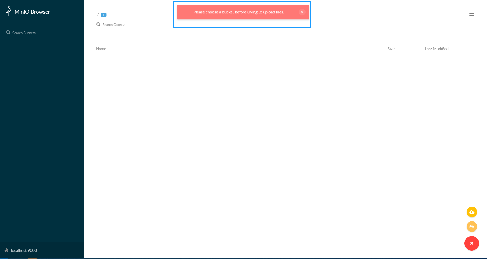
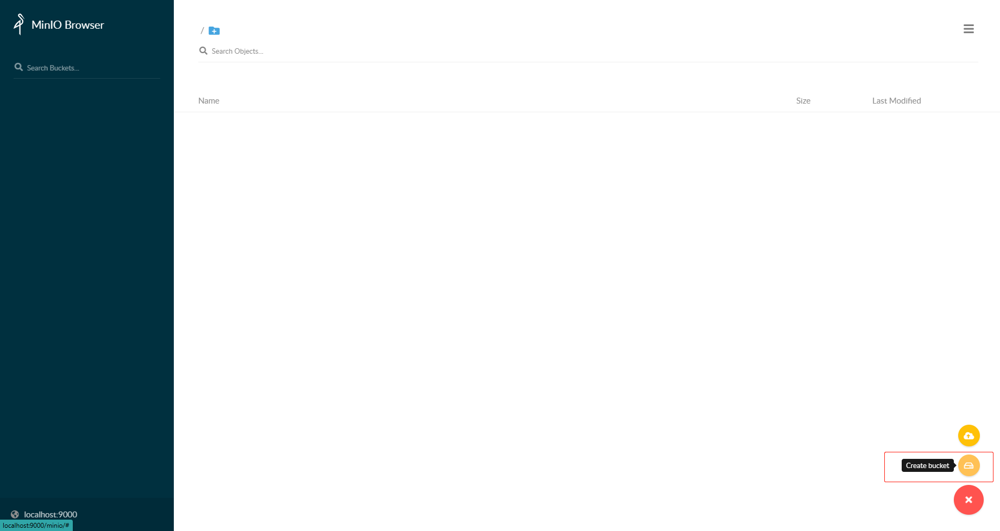
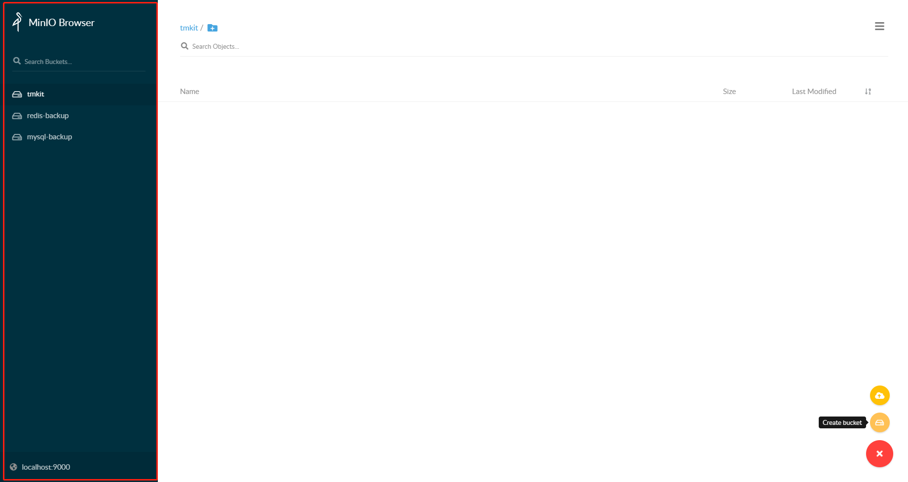
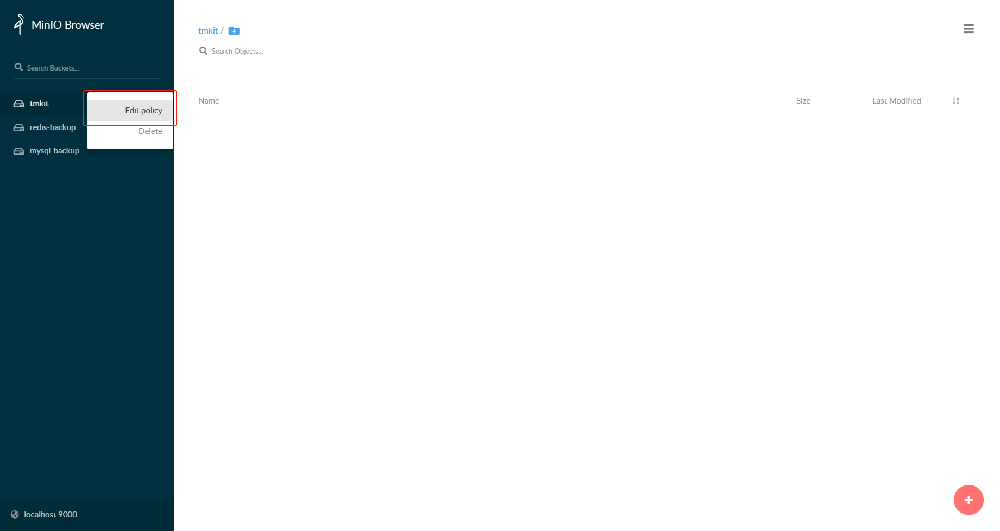
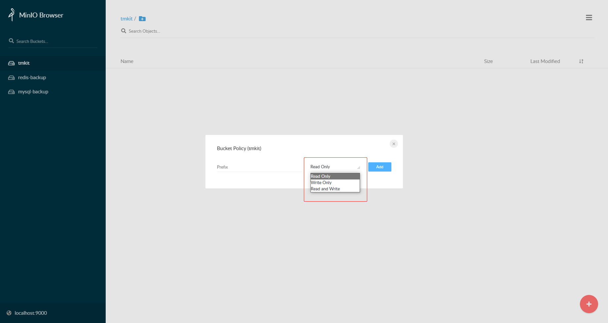

# MinIO桶的概念介绍

## 桶（`Bucket`）的定义

`MinIO`使用存储桶来组织对象。存储桶类似于文件系统中的文件夹或目录，其中每个存储桶可以容纳任意数量的对象。简单来说桶就是一个最高级别的分类。

## 桶的命名规则

1. 桶名称的长度必须介于3到63个字符之间
2. 桶名称只能由小写字母、数字、英文字母点（.）和英文字母连字符（-）组成
3. 桶名称不得包含两个相邻的英文字母点，或与英文字母连字符相邻的英文字母点
4. 桶名称的格式不能为IP地址（例如`192.168.1.4`）
5. 桶名称不得以前缀`xn`开头
6. 桶名称不得以后缀`-s3alias`结尾。此后缀保留用于接入点别名
7. 桶名称在分区中必须是唯一的。
8. 桶名称不能包含大写字符或下划线
9. 桶名称必须以小写字母或数字开头

## 管理后台中关于桶的使用

在控制台，如果我们不创建桶直接进行文件上传的话，MinIO会提示错误信息`Please choose a bucket before trying to upload files.`。所以必须要先创建一个桶。

### 1、桶的创建

通过右下侧的按钮可以很容易创建一个存储桶。

### 2、桶的查询

左侧列表展示了所有的桶

### 3、策略控制

对于每个桶都可以设定三种操作策略：只读、只写和读写。

1. 任意策略

  也就是桶下所有的对象资源都可以被访问。

2. 自定义策略

  比如输入`d`则表示只允许访问资源名称`d`开头的。

