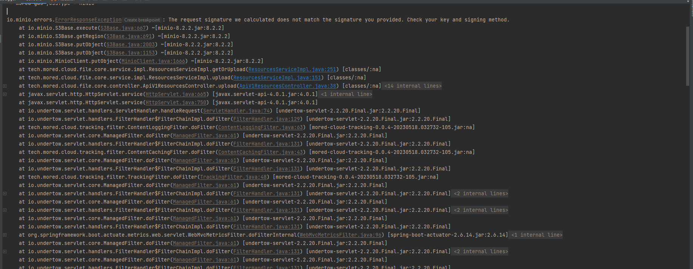

# MinIO 报错The request signature we calculated does not match the signature you provided

一个粗心大意，可能会导致你怀疑人生。本次记录的这个问题就是如此，差不多围绕了两天。

## 问题现象

当我通过Spring Boot项目连接MinIO进行文件上传时，给我来了这么一个错误`io.minio.errors.ErrorResponseException: The request signature we calculated does not match the signature you provided. Check your key and signing method.`，完整的错误下图所示：



## 解决的过程

由于自己也没怎么好好用过`MinIO`，那出现了问题只能通过`bing`找答案了，但是搜索到答案都是关于`Nginx`代理`MinIO`导致签名不匹配的问题。但我的情况是直连`MinIO`的。终于在第二天的时候，在核对与自己之前部署有何不同的时候，终于发现了出现原因是：在Spring Boot程序中配置的账号密码与服务端不匹配。


## 罗列可能的原因

* **仔细检查账号密码是否正确**

  确保`MinIO`服务端和客户端（如Spring Boot）两者的账号和密码必须是一致的。本来这种提示觉得有点蠢，但是我这两天就是这么蠢，这么粗心。

* **Nginx反向代理不可缺少的配置**

  ```nginx
  proxy_http_version 1.1;
  proxy_set_header Host $http_host;
  ```

  完整的官方Nginx实例应该如下：

  ```nginx
  修改为官方的配置文件即可解决此问题
    server {
        listen 80;        
        server_name minio.tmkit.cn;
        client_max_body_size 20M;
        #PROXY-START/
        location /
        {
            proxy_set_header X-Real-IP $remote_addr;
            proxy_set_header X-Forwarded-For $proxy_add_x_forwarded_for;
            proxy_set_header X-Forwarded-Proto $scheme;
            proxy_set_header Host $http_host;

            proxy_connect_timeout 300;
            # Default is HTTP/1, keepalive is only enabled in HTTP/1.1
            proxy_http_version 1.1;
            proxy_set_header Connection "";
            chunked_transfer_encoding off;

            proxy_pass http://192.168.10.102:9000; 
        }
        #PROXY-END/
    }
    ```
