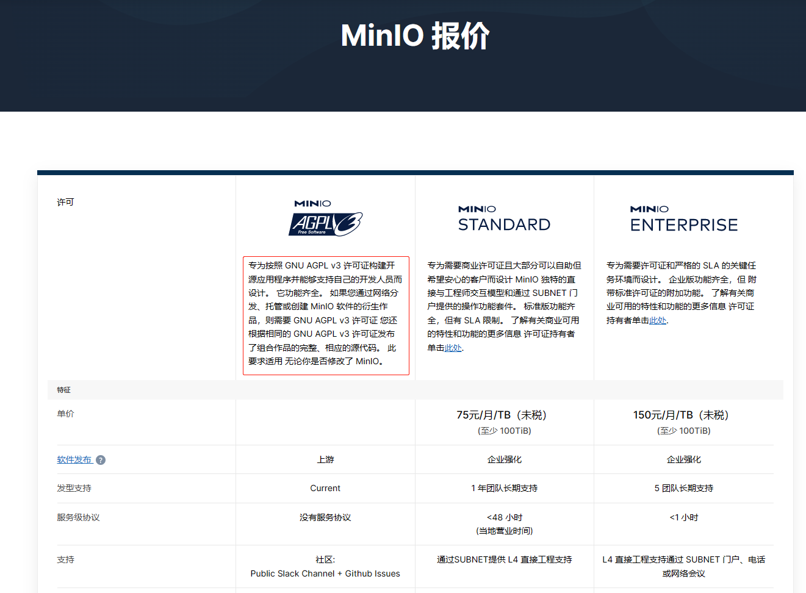

# MinIO最后一个可免费商用的版本

先来总结话语

* https://github.com/minio/minio/tree/RELEASE.2021-04-22T15-44-28Z
* https://hub.docker.com/r/minio/minio/tags?page=1&name=RELEASE.2021-04-22T15-44-28Z

## 选型的过程

最近在做对象存储的选型，了解到了MinIO、FastDFS等产品，对于FastDFS的安装基本看到的都是比较麻烦（包括我身边的同学），于是想了解一下MinIO。

一开始没有直接去官网查看，在网上搜索的安装教程讲到的都是`Apache License 2.0`协议，不过后来我不是很放心，然后去官网看了下介绍（有中文，赞），发现现在的协议是`AGPLv3`，**一句话概括这个协议就是不能商用的**。



官网已经写的非常请求，不管你有没有修改`MinIO`，用了它就必须得开源自己的源代码，显然这并不适用于公司了。

那网上之前说的都是`Apache License 2.0`协议，那应该是半路更换了协议，所以我们需要找到最后一个可以免费用于公司的那个版本。

## Github最后一个`minio-RELEASE.2021-04-22T15-44-28Z`

首先来到MinIO的Github网站：https://github.com/minio/minio ，项目的根目录下有一个`LICENSE`文件，指明了现在采用的软件协议。通过人工判断，最后确定最后一个基于`Apache License 2.0`协议的`release`是： https://github.com/minio/minio/releases/tag/RELEASE.2021-04-22T15-44-28Z

也就是从2021年5月份之后的所有版本不在免费用于公司，当然可以选择付费支持哈。

## Docker镜像最后一个`RELEASE.2021-04-22T15-44-28Z.hotfix.56647434e`

执行如下命令可以验证使用的软件协议：

```sh
docker exec docker exec tm-minio cat /licenses/LICENSE | more
```

其中`tm-minio`为容器名。

