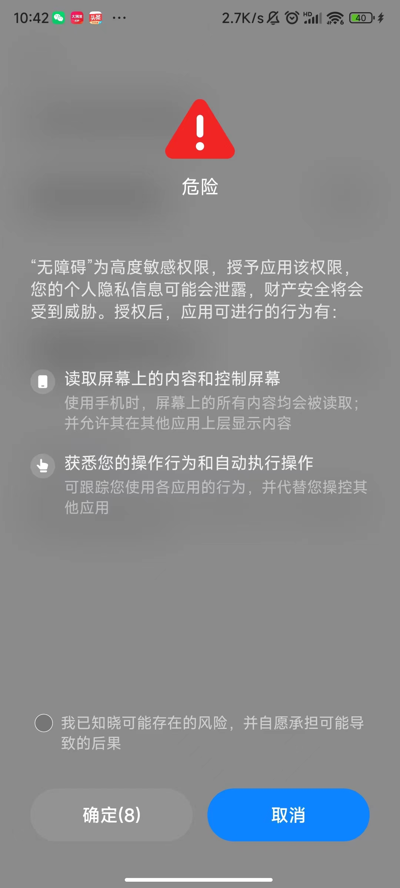

# 618又开始了，解放双手，还可以！

## 618活动

一年一度的618年中大促销又开始了，我想现在大家对于这样的大促销的热情已经逐渐消退了，但是不可否认的是，确实有一些优惠力度在的。但是大家也懂，为了大家有参与度，我们必须要做各种各样的任务，有时候就不想要这些“蚊子肉”了。

今年的活动实在5月23日0店正式开始，活动分为3个玩法：

1. 每日拆快递
2. 全民瓜分20亿活动，时间在6月18日~6月20日
3. 拉好友一起玩，就是拉新

## 软件介绍

今天给大家介绍这款软件是Android版本的，所以iPhone的同学们无望了。**软件安装以后需要“开启悬浮窗”和“开启无障碍服务”这两项权限。**软件的首页如下：

安装的过程中会有提示（小米），如果大家不放心，那就不要薅羊毛啦。

下面演示下如何开启必要的两项（以小米）：

* **开启悬浮框**

  点击【开启悬浮框】按钮，在弹出的页面找到【全民拆快递】这个应用，然后开启【允许显示在其他应用的上层】这个选项。

  

* **开启无障碍服务**

  点击【开启无障碍服务】按钮，在弹出的页面选择【已下载的应用】进入下一个页面，然后选择【全民拆快递】应用再进入下一个页面，点击【使用全民拆快递】这个选项，小米会有一个警告提示，等待10s后确认即可。

  

  

  

然后就可以在【任务】菜单看到JD和TB的任务，比如点击【开始京东任务】按钮，会有一个【任务设置】，一般默认即可。

如果碰到App不生效那么多重试几次就可以了，整体比自己点肯定要轻松很多。

## 软件获取

1. 点下面的小卡片，关注下公众号

2. 关注后在对话框内容发送： 230526 获取下载地址。

