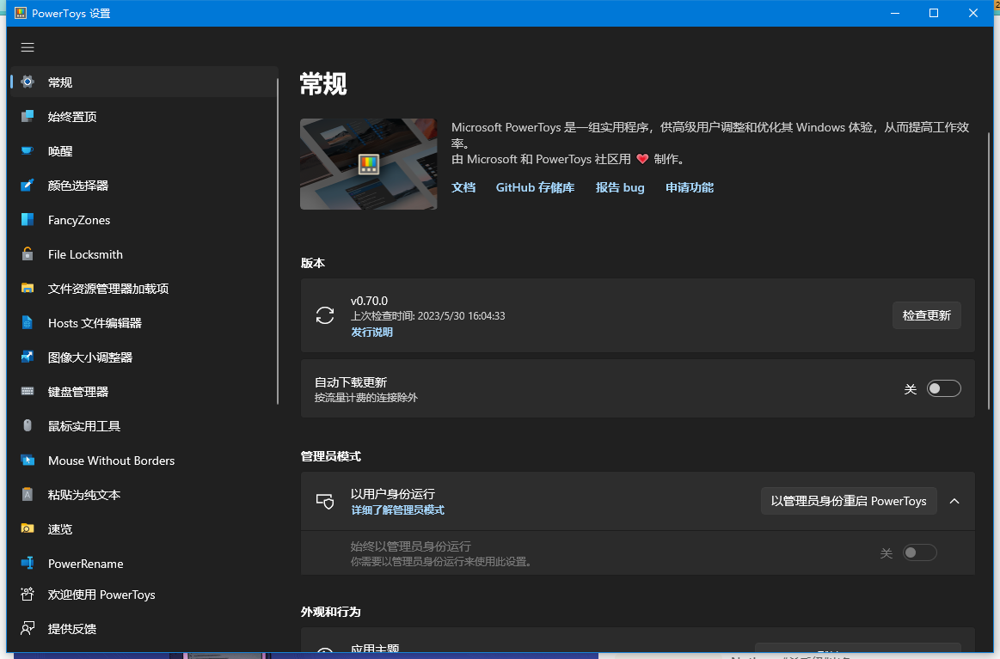
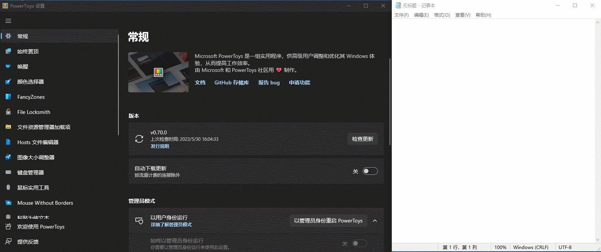
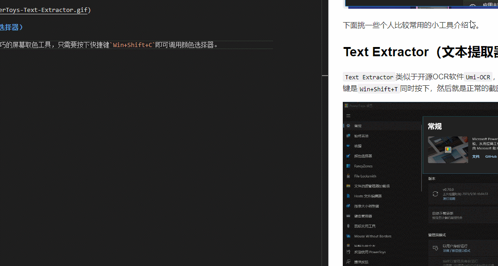
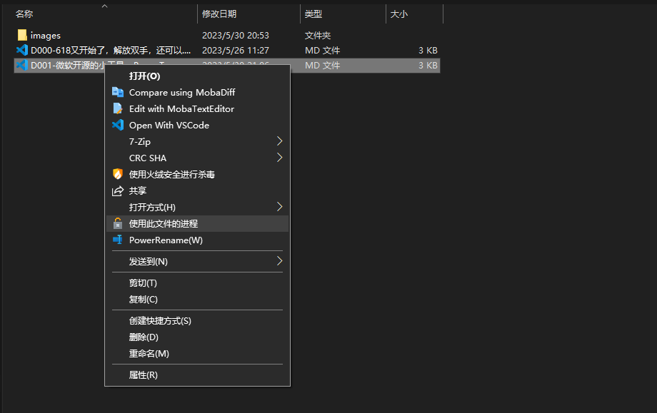
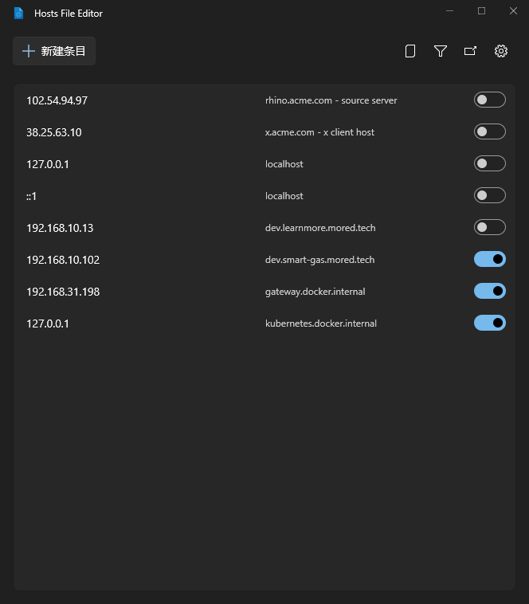

# 微软开源好用的小工具—PowerToys

[toc]

## 前言

`Power Toys`是微软为Windows系统推出的一系列免费实用小工具合集。自从微软重金收购`GitHub`之后，微软的对开源是越来越重视了，发布了`Visual Studio Code`、`Windows Terminal`、`Linux SubSystem`等。

## 下载地址

官方下载地址在Github上，但是Github可能我们上不去：`https://github.com/microsoft/PowerToys/releases`。所以搬运到了阿里云盘，大家可以去阿里云盘下载：`https://www.aliyundrive.com/s/KXGzY2mw55g`

### 安装要求

* 支持的操作系统

  * Windows 11（所有版本）
  * Windows 10 v2004(19041)或更高版本

* 系统体系结构

  * 当前支持`x64`和`ARM64`体系结构

## Power Toys 简介

> Microsoft PowerToys 是一组实用工具，可帮助高级用户调整和简化其Windows体验，从而提高工作效率。

官方介绍地址在这：`https://learn.microsoft.com/zh-cn/windows/powertoys/`。简单来讲呢就是，这是官方提供的外挂程序，可以调教自己的Windows系统，让Windows系统更好好用。而且可在主界面里选择启用/设置某款小工具，目前新版本支持了中文了。

下面挑一些个人比较常用的小工具介绍下。

## Text Extractor（文本提取器）

`Text Extractor`类似于开源OCR软件`Umi-OCR`，可以直接截图并识别出其中的文本，并将内容放在剪切板上。默认的快捷键是`Win+Shift+T`同时按下，然后就是正常的截图操作了。

## ColorPicker（颜色选择器）

`ColorPicker`是一款小巧的屏幕取色工具，只需要按下快捷键`Win+Shift+C`即可调用颜色选择器。我们只需要移动鼠标指针到希望取色的位置，他就能自动读取屏幕上该座标的颜色值。

根据厉害的是，它可以使用【鼠标滑轮】调出放大镜进行取色，意思就是说可以将鼠标所在位置放大，达到精确取值。

## PowerToys Run

`PowerToys Run`是一款快速启动器工具，类似于`Listary`工具，只需要按下快捷键`Alt+Space`即可唤起输入框，然后输入需要启动的应用，不过目前功能比较简单，不支持拼音搜索。期待后面的更新能够更加好用。

## File Locksmith

`File Locksmith`是一款文件占用解锁工具，类似于`Unlocker`工具，只需要选择某个文件鼠标右键后选中【使用此文件的进程】，该工具立即查看到底是什么程序（进程）一直占用着该文件，同时还很方便的【结束任务】来解锁文件。

## Host文件编辑器

如果我们经常要修改Windows系统**Hosts**文件的需求，那现在PowerToys提供了可视化的操作，方便了我们新增、修改和删除Hosts的内容。

## 其它小工具

本篇内容是基于`v0.70.0`编写的，目前以支持的小工具为：

* **始终置顶**：将窗口固定在顶部的小工具
* **唤醒**：使电脑保持唤醒状态的小工具
* **颜色选择器**：快速取色的小工具
* **FancyZones**：大屏的窗口布局小工具
* **File Locksmith**：查看文件被占用的小工具
* **文件资源管理器加载项**：可以在资源管理器右侧预览内容的小工具
* **Hosts文件编辑器**：Hosts编辑器的小工具
* **图像大小调整期**：右键调整图像大小的小工具
* **键盘管理器**：通过重新映射键和快捷键来重新配置键盘的小工具
* **鼠标实用工具**：围绕鼠标的小工具
* **Mouse Without Borders**：一个鼠标可以控制多个多个设备的小工具
* **粘贴为纯文本**：一个去格式的小工具
* **速览**：快速预览的小工具，通过快捷键`Ctrl+Space`呼出
* **PowerRename**：批量重命名文件的小工具
* **PowerToys Run**：快速启动器的小工具
* **Quick Accent**：一个重音输入的小工具，其它语种用得到
* **注册表预览**：可视化和编辑复杂的Windows注册表文件的小工具
* **屏幕标尺**：用于测量屏幕上像素的小工具
* **快捷键指南**：显示包含Windows快捷键的的小工具
* **文本提取器**：OCR提取的小工具
* **视频会议静音**：麦克风和摄像头全局“静音”的小工具
