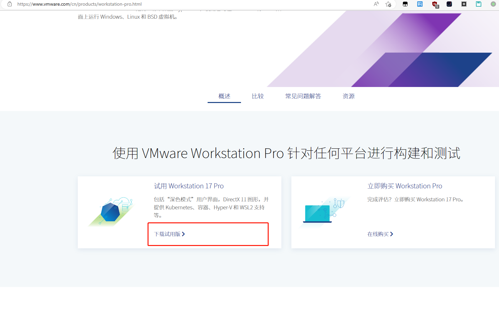

# VMware Workstation的下载与安装

## 下载`VMware Workstation`

1. 首先我们访问`VMware`中国官网地址：`https://www.vmware.com/cn.html`，然后点击【产品】→【Workstation Pro】，如下图所示：

2. 进入下页面后，点击【下载试用版】，如下图所示：

   

3. 然后会打开新的页面，在新的页面稍微往下滑动，就会看到`VMware 17 Pro for Windows`的按钮【Download Nowadays】，点击之后就会自动下载的。

### 下载地址

* 官方的下载地址为`https://download3.vmware.com/software/WKST-1700-WIN/VMware-workstation-full-17.0.0-20800274.exe`。
* 阿里网盘共享的分别为16、17的VMware下载地址。

[VMware 17 下载安装及永久激活使用教程 - 嘿笨笨熊 - 博客园 (cnblogs.com)](https://www.cnblogs.com/hellogmy/p/17253041.html)

[VMware Workstation 17.0 Pro Unlocker & OEM BIOS for Windows & Linux - sysin | SYStem INside | 软件与技术分享](https://sysin.org/blog/vmware-workstation-17-unlocker/)

