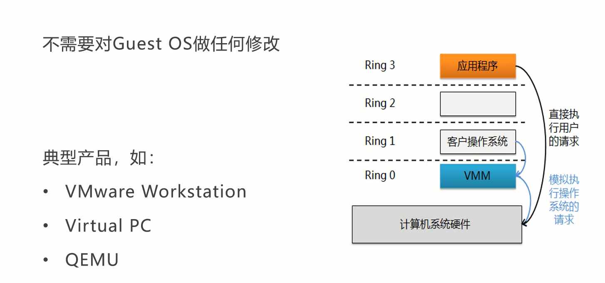
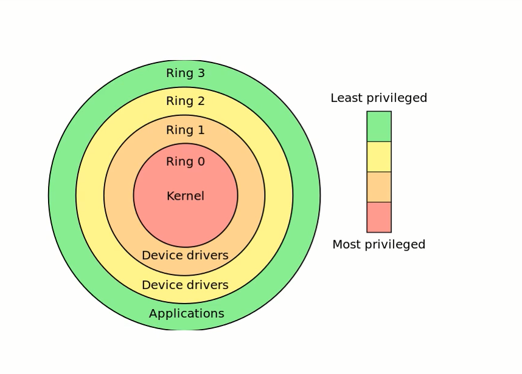

# 虚拟化的介绍

[toc]

本文主要内容是虚拟化相关概念。

## 什么是虚拟化

虚拟化是一种计算机技术和思想，它可以将一个物理计算机资源划分为多个虚拟的计算机资源，以便多个应用程序或操作系统可以在同一台物理计算机同时运行，从而提高资源利用率和灵活性。虚拟化技术可以通过模拟硬件、操作系统和应用程序等多个层面来实现，可以分为硬件虚拟化和软件虚拟化两种类型。

## 虚拟化的作用

* 提高硬件资源利用率
* 降低成本
* 完全的隔离
* 按需分配，随意切割物理资源

## 虚拟化的发展史

* 1960年：IBM公司开发了第一代虚拟化技术，称为CP/CMS。这种虚拟化技术可以在一台计算机上同时运行多个操作系统，并将它们隔离开来，从而提高计算机资源的利用率和效率。
* 1980年：虚拟化技术主要是在Unix系统上开发和使用的，如IBM公司的AIX、Sun Microsystems的Solaris和Digital Equipment Corporation的VAX/VMS等。
* 2000年：虚拟化技术在企业服务器和数据中心中得到广泛应用。主流的虚拟化技术包括VMware、Microsoft Hyper-V、Citrix XenServer等。虚拟化带来了更高效的资源利用、更便捷的部署和管理、更灵活的应用扩展和迁移等好处，使得企业的IT基础设施更加灵活和可扩展。
* 2006年：KVM是Kernel-based Virtual Machine的缩写，它利用了Linux内核的虚拟化功能，将Linux操作系统转换为一个虚拟机监视器，从而可以在同一台物理服务器上运行多个虚拟机。
* 2014年：容器技术的出现开启了虚拟化技术的第四个阶段。容器技术可以将应用程序和其所需的运行环境打包成一个独立的容器，从而实现更高效、更快速的部署和运行。Docker作为当时最流行的容器技术之一，获得了广泛的关注和应用。此外，无服务器技术也开始崭露头角，可以帮助开发人员更轻松地构建和部署应用程序，从而提高开发效率和灵活性。

## 虚拟化资源分类

在虚拟化技术中，被虚拟化的实体是各种各样的IT资源。如果按照这些资源的类型分类，可以梳理出不同类型的虚拟化：

* 服务器虚拟化

  服务器虚拟化（Server Virtualization）就是将虚拟化技术应用于服务器，将一台服务器虚拟成若干个虚拟服务器，在该服务器上可以支持多个操作系统同时运行。

* 网络虚拟化

  网络虚拟化（Network Virtualization）就是物理网络资源划分为多个虚拟网络示例的技术，使得多个虚拟网络可以共享同一组物理网络设备。

* 存储虚拟化

  存储虚拟化（Storage Virtualization）是将物理存储资源抽象为虚拟化存储池，使多个存储设备可以被逻辑上管理和分配。通过存储虚拟化，可以提供更高的灵活性和可扩展性，简化存储管理和优化存储资源利用。

* 桌面虚拟化

  桌面虚拟化（Desktop Virtualization）是一种将个人电脑的桌面环境从物理计算机中解耦，使用户可以通过网络访问虚拟化的桌面实例。它将操作系统、应用程序和用户数据隔离于终端设备，提供了更灵活、安全和可管理的桌面体验。

## 硬件虚拟机（Hardware Virtualizaiton）

硬件虚拟机又称为全虚拟化技术，是在物理硬件上模拟出一个完整的计算机系统，包括CPU、内存、磁盘、网络等硬件设备。硬件虚拟机通常需要使用特殊的CPU指令或硬件支持，可以在虚拟机中运行多种操作系统和应用程序。比如常见的硬件虚拟化产品包括：

* VMware Workstation：VMware公司开发的一款桌面级虚拟化技术，可以用于创建和管理虚拟机，在Windows、Linux和MacOS都有支持。
* Microsoft Hyer-V：微软公司开发的虚拟化技术，可以在`Windows Server`操作系统上创建和运行虚拟机。

## 软件虚拟化（Software Virtualization）

软件虚拟化又称为容器虚拟化（Container Virtualization），指通过软件进行资源抽象和隔离，从而在物理设备运行多个操作系统或应用程序。比如常见的软件虚拟化产品包括：

* Docker：一种流行的开源容器平台，允许开发者将应用程序及其它依赖打包成容器，可以在多个环境中轻松部署和运行。

https://www.bilibili.com/video/BV1JL411K7Sr/?spm_id_from=333.788&vd_source=92c1110785c5f29a0d7bc2a75139a53c

## 宿主结构虚拟化

宿主结构虚拟化技术使用的是类型-Ⅱ架构，也称为hosted架构，它运行在操作系统之上，通过在宿主操作系统和虚拟机之间引入一个虚拟化层，来模拟出一个虚拟的操作系统环境。

## 原生架构虚拟化

原生架构虚拟化技术使用的是类型-Ⅰ架构，也称为bare-metal架构，它是直接运行在物理计算机硬件之上，没有宿主操作系统的介入，可以更高效地管理和分配计算机资源。

由于宿主结构虚拟化技术需要在宿主操作系统和虚拟机之间进行资源调度和转换，因此它的性能和效率可能会受到一定的影响。而原生架构虚拟化技术可以直接访问物理计算机的硬件资源，因此可以提供更高的性能和效率。

宿主结构虚拟化技术通常用于桌面虚拟化、测试和开发环境等场景，它可以在宿主操作系统上面运行多个虚拟机实例，提供独立的操作系统和应用程序环境。而原生架构虚拟化技术通常用于数据中心、云计算和网络虚拟化等场景，它可以为不同的用户或应用程序提供独立的虚拟计算机，实现资源共享和隔离。

## 主流服务器虚拟化产品

* VMware公司的VMware Server、VMware ESX/ESXi Server、VMware Workstation
* Microsoft公司的Hyper-V、VirtualPC和Virtual Server
* IBM公司的PowerVM、zVM
* Citrix（思捷）公司的XenServer
* 华为公司的FusionSphere
* 开源虚拟化软件Docker、KVM、Xen等。

## CPU工作级别

在X96体系CPU指令集中，CPU有4个特权级：Ring0、Ring1、Ring2和Ring3，Ring0拥有最高的权限，Ring3层拥有最低的权限。我们的应用程序处于Ring3级别，Ring3是最低的权限，是没有办法直接操作计算机系统硬件的，所以需要有一个状态的切换，这就是所谓的用户态到内核态的切换。

## 虚拟化的应用场景

1. 数据中心和云计算

  比如说阿里云、腾讯云、AWS等这一类云厂商，都是通过虚拟化技术来实现的，我们购买的一般都是虚拟机。

2. 测试和开发环境

  这个一般用于公司团队，比如公司购买了二手的机架式服务器，这类服务器非常的便宜，三、四千块钱就可以购买到非常高的配置了（一般能达到48Core、64GB、4TB等），通过虚拟化技术可以将一台物理服务器虚拟出4-5台。

3. 安全和隔离环境

  这种一般都是个人把玩，比如自己的电脑是32G、1TB SSD，可以通过虚拟化技术，虚拟出几个电脑来，可以用于软件测试、部署试错等。

