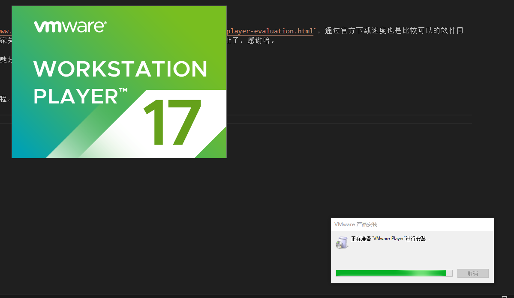
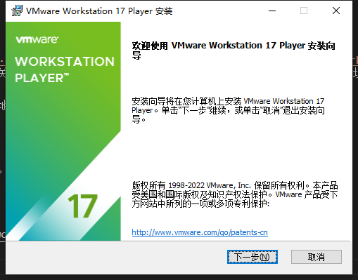
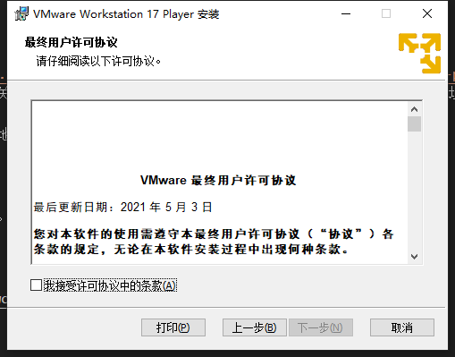
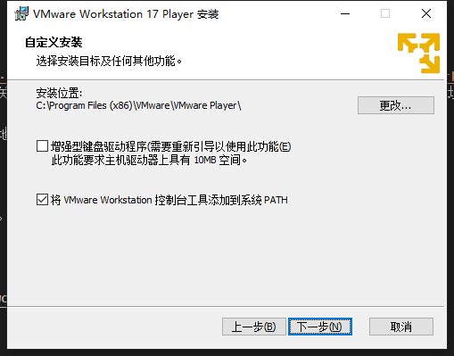
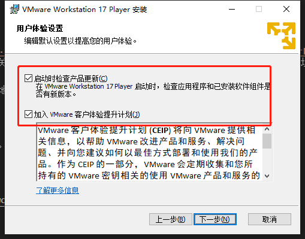
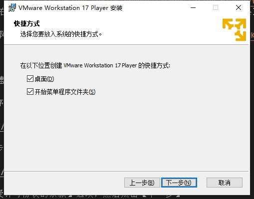
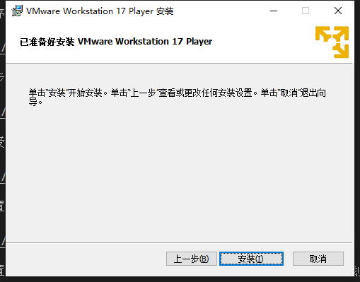
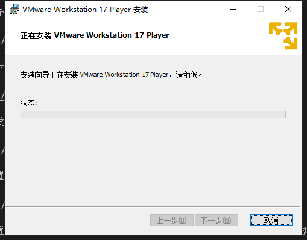
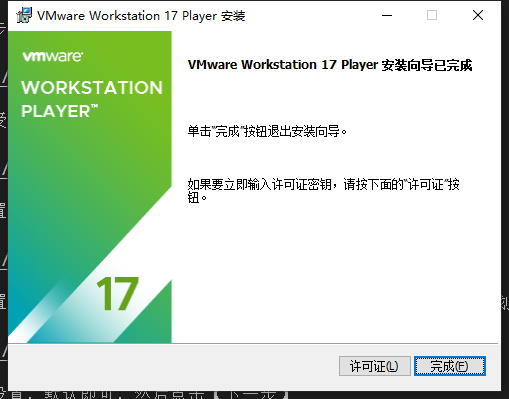

# VMware Player的下载与安装

## 简介

`VMware Workstation Player`是`VMware`公司退出的一款简易虚拟机软件，是`VMware Workstation`的免费版，功能较`VMware Workstation Pro`简单，可免费用于个人非商业用途。

### 可支持各种操作系统

`VMware Workstation Player 17`虚拟机可以完美支持`Windows 11`、`Windows 10`、`Windows 8.1`、`Windows 7`、`Windows Vista`、`Windows XP`等全系列微软操作系统，以及`Ubuntu`、`Red Hat Enterprise Linux`、`CentOS`、`Alma Linux`、`Fedora`、`Deepin`等`Linux`系统。

### 支持创建虚拟机

`VMware Workstation Player`目前已经可以创建虚拟机了，具体从哪个版本开始我也没去统计了，不过增加这个功能大大提升了它的实用价值。

### 免费版支持快照

之前在`VMware Workstation Player`的免费版里，我们是没办法享受到虚拟机中非常好用的**快照（Snapshot）**功能的。而在新版本中`VMware Workstation Player`也可以免费使用了，实用性再次拔高了许多。

## 下载

官网下载地址为`https://www.vmware.com/cn/products/workstation-player/workstation-player-evaluation.html`，通过官方下载速度也是比较可以的软件同时在云盘也有同步，麻烦大家关注下公众号，然后回复【DarkMode】关键字就可以获取下载地址了，感谢哈。

，同时也提供了阿里云的下载地址`https://www.aliyundrive.com/s/CdMPwwFNKC3`。

## 安装

下面开始介绍完整的安装过程。

1. 双击安装程序``

  

2. 点击【下一步】按钮

  

3. 点击【我接受许可协议的条款】选项，然后点击【下一步】

  

4. 自定义的配置，不用管，直接点击【下一步】

  

5. 用户体验设置，将【启动时检查产品更新】和【加入VMware客户体验提升计划】两个选项取消，当然也可以不用了，然后点击【下一步】

  

6. 快捷方式的设置，默认即可，然后点击【下一步】

  

7. 已准备好安装VMware Workstation 17 Player，直接点击【下一步】

  

8. 安装的过程中，这个过程不需要我们干预

  

9. 安装成功后，点击【完成】即可。

  

到此安装结束。VMware Workstation 17 Player是可以免费使用的，所以不需要输入序列号。
