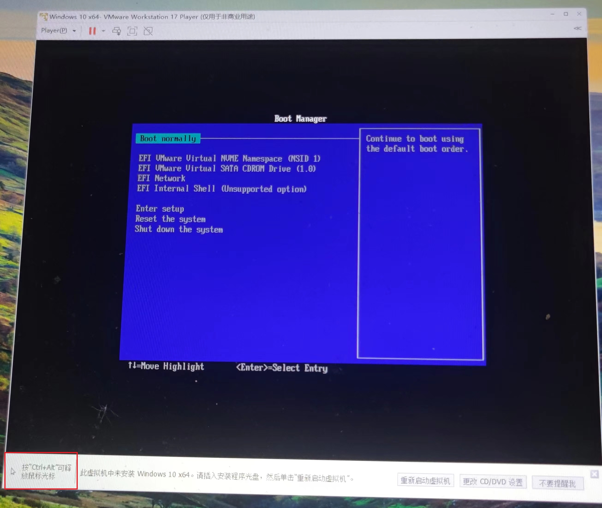
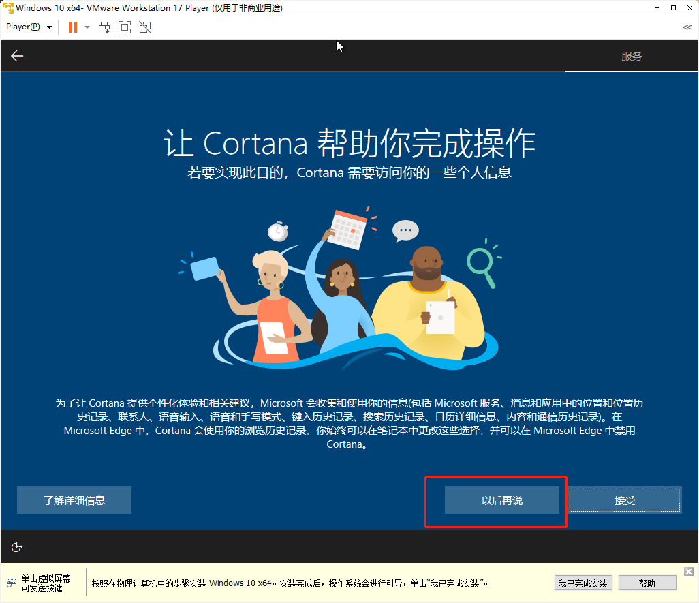

# VMware Player如何创建虚拟机和安装Windows篇

[toc]

## 前言

在上一次中我们分享了`VMware Workstation Player 17`的安装过程，软件装好之后，肯定需要知道如何使用吧，不过`VMware Workstation Player`用起来还是比较简单的。本次先以创建Windows虚拟机为例了解整个过程。

## 创建虚拟机

### 打开`VMware Workstation Player 17`软件

`VMware Workstation Player 17`的图标看起来如下图所示：

第一次使用有一个许可证的提醒，我们不用于商业，所以直接点击【继续】按钮即可

### 点击【创建新虚拟机】按钮

进入到主界面后，我们点击【创建新虚拟机】按钮

### 安装来源的选择

我一般养成的习惯是选择【稍后安装操作系统】这个选项，如果选择镜像文件（ISO），VMware会尝试解析并增加一些引导配置，但是我觉得这些引导并不好。

### 选择客户机操作系统

我这里以Windows系统为例，所以自然选择【Microsoft Windows】，然后系统版本选择【Windows 10 x64】

### 命名虚拟机

给虚拟机去一个名字，我用到现在应该没啥限制，中文英文都可以，带空格也支持。

然后需要将虚拟机保存在哪里，这个就找一个磁盘比较大的地方存储就好了，至少要有20G的空闲空间。

### 指定磁盘容量

我这里演示就配置了20G，实际情况根据自己的磁盘大小合理分配就可以。软件默认选择【将虚拟磁盘拆分成多个文件】这个选项，特点是不会直接占用实际磁盘的容量，比如我配置了20G，实际占用可能才几十M而已（未安装操作系统时），缺点就是有幸能损失。

所以重点来了，如果虚拟机作为日常使用比较频繁的话，那么建议选择第一个选项【将虚拟磁盘存储为单个文件】，这样可以提升虚拟机的性能。

### 已准备好创建虚拟机

到这里的话，基本上快要完成了，但是我又要说我的个人习惯了，我习惯点击【自定义硬件】的按钮，修改调整下。

### 自定义硬件

这里主要涉及到CPU、内存的配置是否需要修改，软件建议安装Windows 10 给的内存是2G，我们就不需要修改了，不然到时候很卡。

打印机可以删除，如果其它设备，比如声卡等，用不到的都可以删除。

点击某一个设备，比如`打印机`，然后点击【移除】按钮就可以了。

最后的硬件保留如下所示：

然后点击【关闭】按钮，继续。

### 已准备好创建虚拟机

到了这里，终于可以点击【完成】按钮，整个以Windows的虚拟机的创建过程就结束了。

## 安装Windows 10

### 选择Windows 10 ISO镜像

在主界面中选中我们刚刚新建的虚拟机，在界面的右侧有一个【编辑虚拟机设置】按钮，点击之后会弹出一个【虚拟机设置】界面。

在弹出框中选中【CD/DVD】，如下图所示：

在【连接】中选择【使用ISO映像文件】，然后点击【浏览】按钮，选中已经下载好的Windows 10 镜像。

选择好了Windows 10 镜像文件之后，最后点击【确定】按钮即可。

### 播放虚拟机

回到主界面之后，点击【播放虚拟机】按钮，它的意思跟我们按真实计算机的开机键一个意思。

`VMware Workstation Player 17`会打开新的一个页面，可能会有这么一个提醒【侧通道缓解】默认启用，VMware Player详细的解释了【侧通道缓解】作用，以及如何关闭。

点击【确定】按钮后，就会进入安装流程。

### 将鼠点一下虚拟机启动页

首先虚拟机启动的时候会有一个VMware的Logo背景，很快就会出现一个提示，这个时候我们需要将鼠标点击下这个区域的任意一个地方，然后按下键盘的任意一个键就会引导光驱启动，否则就会出现下面的一个提示。

出现黑屏并且显示`Time out`的提示，我们只需要重启，不过在介绍如何重启前我们需要先知道如何鼠标控制权交给宿主机（真正的物理主机），因为这个时候鼠标的捕获和控制完全有虚拟机控制了，需要同时按下快捷键`Ctrl+Alt`，鼠标的控制权又回到了宿主机了。

鼠标回到宿主机之后，我们有两种方式快速重启虚拟机，第一个方式就是直接点击软件下面的提示的按钮【重新启动虚拟机】

还有一种方式就是点击上面菜单栏有一个类似于暂停图标旁边的下拉按钮，在弹出的菜单中，点击【重新启动虚拟机】按钮：

### Windows10安装启动

首先我们看到一个Windows安装启动的页，如下图所示：

稍等一会儿就会进入到安装的真正引导首页了，如下图所示：

保持默认即可，直接点击【下一步】按钮。

### 现在安装

来这个这个页面我们直接点【现在安装】按钮即可，如下图所示：

### 选择要安装的操作系统

来到这个安装引导页面后，我们需要选择自己想要安装的操作系统类型，我的建议就是选择【专业版】就可以了，其他各个版本我们一般情况下用不到。然后点击【下一步】按钮：

### 适用的声明和许可条款

来到这个安装引导页面后，我们首先点击【我接受许可条款】选项，然后点击【下一步】按钮：

### 你想执行哪种类型的安装？

来到这个安装引导页面后，我们要选择第二个选项【自定义：仅安装Windows（高级）】：

### 你想将Windows安装在哪里？

来到这个安装引导页面后，就是要硬盘分区，由于我们只分配了20G，不够分C盘、D盘，所以这里很简单，直接点击【下一步】按钮即可：

### 正在安装Windows

来到这个安装引导页面后，终于开始安装了，安装时间具体有自己的计算机硬盘性能了，如果是SSD固态硬盘的话，会快许多，如果是机械硬盘，就需要多等些许了。

放了一张安装过程的图：

在等待一段时间后，我们会看到需要重启的提示，默认等待15s后自动重启的：

重启之后，会来到如下图的安装过程中，这个过程也需要等待一段时间的：

期间还会重启，这个过程我们无需干扰。

### 基本-区域选择

经过一段时间的等待之后，会来到【区域设置】页，默认根据地理位置会选中【中国】，如果不是自己调整下。

### 基本-键盘布局

这个看自己能力了，会五笔的选择五笔，不会的就默认拼音了。

### 基本-第二种键盘布局

一般不需要的，直接点击【跳过】按钮即可。

### 网络

会进入网络的一些设置，就等着它转圈圈吧。

然后系统又会重启一次。

### 账户-希望以何种方式进行设置？

重启后还需要等待下，然后来到【希望以何种方式进行设置】的界面，选择第一项【针对个人使用进行设置】，然后点击【下一步】按钮：

### 账号-在线账户

Windows 10 操作系统默认引导用户使用在线的微软账号，我们选择不用在线账号，点击【脱机账号】即可：

### 账号-再次引导在线账户

我们继续不使用在线账户，点击【有限的体验】后，点击【下一步】按钮：

### 账户-谁将会使用这台电脑？

简单来说就是配置登录系统的用户名，整一个自己记得住的账号吧。

### 账户-创建容易记住的密码

### 账户-确认你的密码

### 账户-为此账户创建安全问题

一共要创建三个问题，这个根据自己的情况选择三个问题，然后填一下答案。

### 服务-为你的设备选择隐私设置

这个坎个人需求，如果都没啥用，那么全部关闭，如下图所示：

### 服务-让我们自定义你的体验

这些我们也没啥用，直接点击【跳过】按钮：

### 服务-让Cortana帮助你完成操作

Windows10PC端没哈用用户，我们可以点击【以后再说】按钮：

再耐心等待一段时间后，终于安装完成了。可以看到Windows桌面了。

## 结束语

写这个这么详情的教程确实麻烦，一步一个截图，基本上每个都到位了吧，麻烦大家点赞、收藏和转发给有需要的朋友们吧。感谢！

