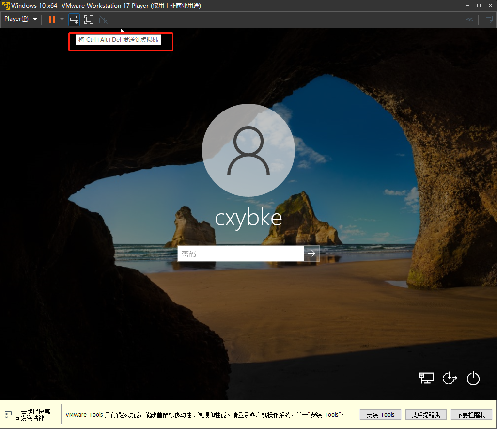
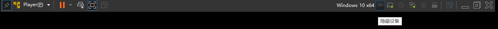
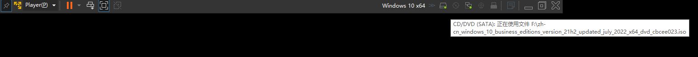

# VMware Player 17 的使用

[toc]

## 前言

在上一篇我们了解到了`VMware Workstation Player 17`如何新建虚拟机和如何安装Windows10操作系统，那本次我们针对`VMware Workstation Player 17`使用展开了解下。

## 菜单栏

### 1、Player菜单

#### 1.1、【文件】→【新建虚拟机】

顾名思义，用来创建新的虚拟机的。主界面有一个快捷按钮【新建虚拟机】是一样的。

#### 1.2、【文件】→【打开】

用于打开已经创建过的虚拟机，比如网上下载别人制作好的虚拟机，可以用这个菜单打开。主界面有一个快捷按钮【打开虚拟机】是一样的。

#### 1.3、【文件】→【下载虚拟设备】

点击这个菜单会调用浏览器并打开`https://bitnami.com/stacks/virtual-machine`，`Bitnami`是一个开源项目，为开源的Web应用程序、开发堆栈以及虚拟设备提供安装程序或安装软件包。前面真实官方术语，说人话就是， `Bitnami`是一个懒人包，将服务器的配置工作简化，标准化，开箱即用。

#### 1.4、【文件】→【首选项】

这里的配置其实没有我们需要了解的，都很简单，而且保持默认就很好了。

#### 1.5、【电源】

默认是灰色不可点击的，需要先选中一个虚拟机，比如我们上次安装的Windows10虚拟机。选中之后就可以点击了。

当虚拟机状态为未开机，那么【开机】按钮可用，点击该按钮即可启动虚拟机，该效果与【播放虚拟机】相同。

当虚拟机状态为已开机，那么【关闭客户机】、【挂起客户机】和【重新启动客户机】三个按钮都可以用。

【关闭客户机】其效果跟把电源一样的， 所以会有警告，也不是我们日常该用的功能。

【挂起客户机】其效果就是把虚拟机暂停，虚拟机状态会变更为【已挂起】。

已挂起的虚拟机可以进行【开机】或【关机】操作。

【重新启动客户机】的效果相当于现在点击【关闭客户机】按钮，然后再点击【开机】按钮。

#### 1.6、【管理】

默认是灰色不可点击的，需要先选中一个虚拟机，比如我们上次安装的Windows10虚拟机。选中之后就可以点击了。

* 【安装 VMware Tools】这个菜单功能非常强大，首先VMware会判断当前虚拟机安装的是什么操作系统，然后根据对应操作系统将驱动镜像ISO加载到光盘中，并且自动更改【光盘】的状态为已连接。
* 【消息日志】这个菜单主要查看一些错误、警告的提示日志。
* 【虚拟机设置】这个菜单用来更改虚拟机的一些配置，后面单独展开了解下。

#### 1.7、【帮助】

一些在线文档的连接按钮，升级为`VMware Workstation Pro`的按钮，其中有一个按钮【输入许可证密钥】这个作用没测试过，所以不了解输入正确的密钥`VMware Workstation Player 17`会变得有什么不同。

#### 1.8、【退出】

就是退出`VMware Workstation Player 17`这个软件，如果有正在运行中的虚拟机，会有一个提示的“你要如何关闭虚拟机？】，这个看自己是挂起虚拟机还是关闭虚拟机。

### 2、【暂停】按钮

这个是一个快捷操作的菜单组，在前面已经详细介绍了每个菜单的作用了。

### 3、下发`Ctrl+Alt+Del`快捷键的命令

这个功能在Windows Server非常重要，必须通过点击这个按钮，Windows Server才能进入输入密码的界面。

### 4、【进入全屏模式】按钮

点击这个按钮，可以让虚拟机的界面以全屏的形式显示，远远的看起来别人以为你更换了操作系统了呢。

### 5、【进入Unity模式】

这个按钮的作用就是将虚拟机转为一个本地应用一样，不过需要先安装`VMware Tools`。

## 全屏模式下的命令栏介绍

同意还是从左往右依次介绍每个菜单的作用

### 1、【隐藏命令栏】

这个按钮类似于别扣一样，将全屏模式下的菜单栏钉住。如果点击这个按钮，首先菜单栏会自动隐藏。

### 2、【总是显示命令栏】

如果菜单栏隐藏了，需要将鼠标移动屏幕顶部（要求鼠标控制权在宿主机），一会儿之后隐藏的菜单栏会显示出来，这个时候第一个菜单按钮是【总是显示命令栏】，点击这个按钮就回到了【隐藏命令栏】，同时命令栏不在隐藏。

### 3、第二到第六菜单

这些菜单在前面已经介绍过了。

### 4、虚拟机的名称

显示的是虚拟机的名称。

### 5、【显示设备】

点击这个按钮，将【隐藏设备】按钮和虚拟机的设备按钮展开显示。

### 6、【隐藏设备】

点击这个按钮，将【隐藏设备】按钮和虚拟机的设备按钮全部隐藏，然后显示【显示设备】按钮。

### 7.1、【硬盘】按钮

表示虚拟机使用的是那个虚拟硬盘，会显示一个硬盘容量。同时我们会发现有一个绿色小点点，代表队是硬盘是连接的。

可以鼠标右键点击，会弹出【设置】按钮，跳转到【虚拟机设置】的【硬盘】设置，这个稍后我们会了解。

### 7.2、【光驱】按钮

表示虚拟机使用了光驱，但是我们会发现没有绿色小点点，表示光驱目前未被使用。

可以鼠标右键点击，会弹出【设置】和【连接】两个按钮，点击【连接】按钮`VMware`会尝试启动光驱，如果光驱没有配置ISO镜像文件，`VMware`有一个错误提示的；点击【设置】按钮跳转到【虚拟机设置】的【光驱】设置，这个稍后我们会了解。

### 7.3、【网络适配器】按钮

表示虚拟机使用了网卡，有一个绿色小点点表示该网络正在使用中。

可以鼠标右键点击，会弹出【设置】和【断开连接】两个按钮，点击【断开连接】按钮`VMware`会将虚拟机网卡禁用，虚拟机就无法上网；点击【设置】按钮跳转到【虚拟机设置】的【网络适配器】设置，这个稍后我们会了解。

### 7.4、【Chicony Integrated Camera】

摄像头，可能名称不一定完全就是这个，但应该有XXX Camera的。这个默认是关闭的。

可以鼠标右键点击，会弹出【连接】、【更改图标】和【隐藏图标】三个按钮。点击【连接】按钮，会连接宿主机的摄像头，并且会有绿色小点点。

### 7.5、【elan:fingerprint】

触摸板，可能名称不一定完全就是这个，具体是什么我没有了解过了。

右键效果和【Chicony Integrated Camera】一样的。

### 7.6、【消息日志】

前面已经介绍过了。

### 7.7、【最小化】

虚拟机最小化，也就是软件最小化。

### 7.8、【退出全屏模式】

退出全屏，恢复之前的。

### 7.9、【关闭】

跟前面介绍的【退出】按钮一样的。

## 虚拟机设置

部分操作支持虚拟机运行状态的，部分是要求虚拟机的状态为关机状态。我们一般可以先将虚拟机关机，然后再调整虚拟机的设置。

