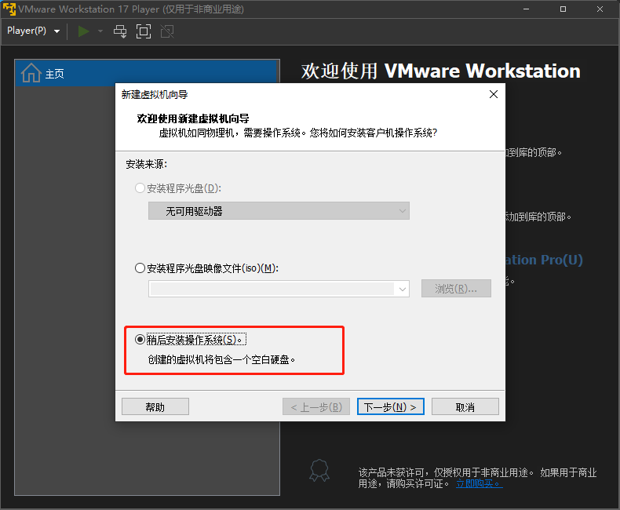

# VMware Player如何创建虚拟机值Linux篇

[toc]

## Linux的选择

Linux的发行版和分支太多了，专注于服务端的Linux操作系统类似如：`Red Hat Enterprise Linux`、`CentOS`、`Ubuntu Server`等，面向于桌面版的Linux操作类似于：`Fedora`、`Debian`、`Ubuntu Desktop`、`Manjaro`等，这些操作系统对老外们入手可能相对较为简单，因为他们没有QQ、微信、企业微信、飞书等等，所以Linux桌面系统想要在国内使用起来，需满足中国这些软件，因为这些是避无可避的（虽然可以折腾，但是很心酸的）。

个人愚见，我觉得目前国内软件生态做的最好的Linxu桌面操作系统是`Deepin`，中文名称叫做`深度操作系统`，`Deepin`解决了这些软件生态问题，提供了一个软件中心的软件，我们日常用的软件都有提供了。当然有些人觉得`Deepin`存在安全问题，这个就自己去想了。**`Deepin`有一个致命缺点就是比较卡，而且比较占用内存。**

所以本次我是以`Deepin V23`为示例，一起看下通过`VMware Player 17`如何安装。

## 创建Linux虚拟机

`VMware Workstation Player 17`的图标看起来如下图所示：

第一次使用有一个许可证的提醒，我们不用于商业，所以直接点击【继续】按钮即可

### 点击【创建新虚拟机】按钮

进入到主界面后，我们点击【创建新虚拟机】按钮

### 安装来源的选择

我一般养成的习惯是选择【稍后安装操作系统】这个选项，如果选择镜像文件（ISO），VMware会尝试解析并增加一些引导配置，但是我觉得这些引导并不好。

### 选择客户机操作系统

`Deepin V23`系统已经直接基于`Linux Kernel 5`开发的，所以选择【Linux】，然后系统版本选择【其它 Linux 5.x 内核 64 位】

