# VMware Workstation Pro 17的下载与安装

[toc]

## 前言

在前面的笔记中介绍了`VMware`，`VMware Workstation Player 17`的安装等，今天我们一起来学习`VMware Workstation Pro`的下载与安装，它是一款更加强大、功能更多的虚拟机软件，当然也是需要Money的。

## 下载

一种方式大家可以去`VMware`官网下载，这里肯定是最新的也是最安全的，直接点击这个下载地址`https://www.vmware.com/products/workstation-pro/workstation-pro-evaluation.html`就会打开最新的下载页，目前是`VMware Workstation Pro 17`。

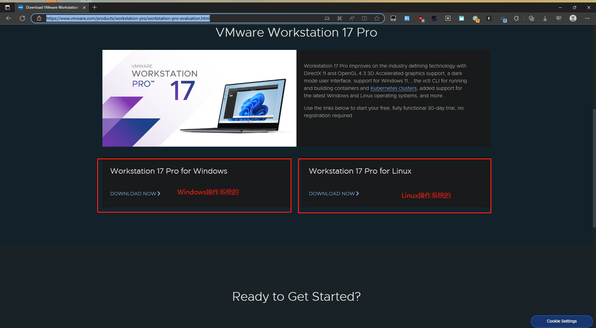

也可以去阿里云网盘（需要先下载阿里云软件），我已经投放在上面了：`https://www.aliyundrive.com/s/8irU9KmsRKH`。

## 安装

### 双击打开软件

找到刚刚下载的软件`VMware-workstation-full-17.0.0-20800274.exe`，需要耐心等待下后进入到安装引导页。

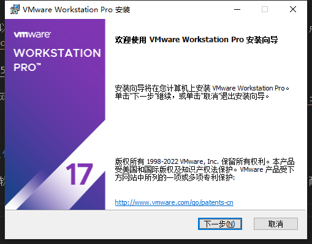

### 安装过程

点击【下一步】按钮进入【最终用户许可协议】的同意：

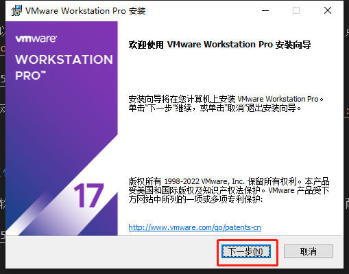

点击【我接受许可协议中的条款】选项，然后点击【下一步】按钮：

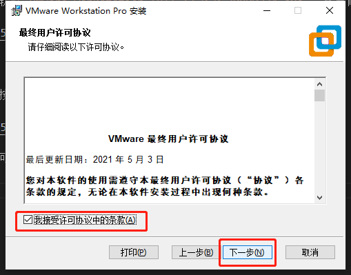

来到了【自定义安装】页，这里可能需要修改的是软件安装位置，大家喜好不愿意安装在C盘的在此修改。然后点击【下一步】按钮：

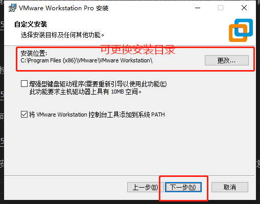

然后来到了【用户体验设置】页，我个人都是全部取消勾选的。然后点击【下一步】按钮：

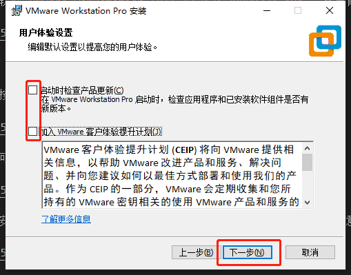

接下来来到了【快捷方式】页，这里没啥可修改的，直接点击【下一步】按钮：

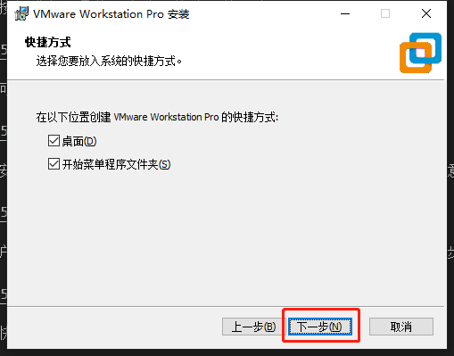

来到了最后一个安装确认页，直接点击【安装】按钮即可：

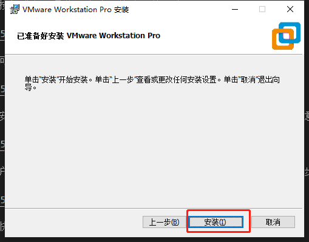

软件的安装过程中：

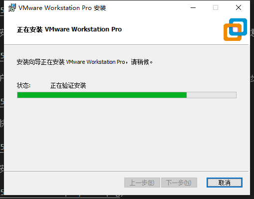

等待一段时间之后，软件安装完成来到【安装向导已完成】页，这里我们点击【许可证】按钮：

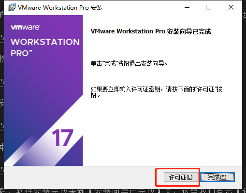

然后就来到了【输入许可证密钥】页：

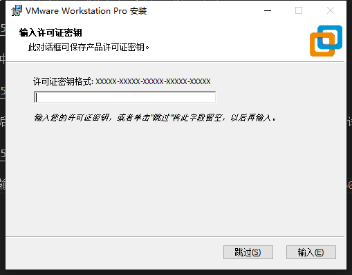

大家都懂的，我这里贴一个密钥`JU090-6039P-08409-8J0QH-2YR7F`，输入密钥之后点击【输入】按钮即可完成授权。

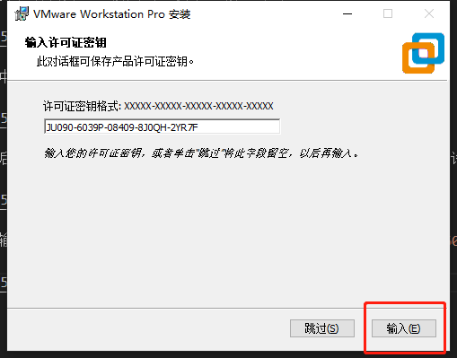

最后来到了【安装向导已完成】页，只有一个【完成】按钮可点击：

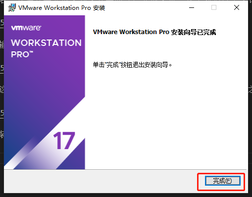

## 打开软件

这个时候我们的电脑桌面多了一个`VMware Workstation Pro`的图标，双击打开之后我们会看到软件的主页面如下图所示：

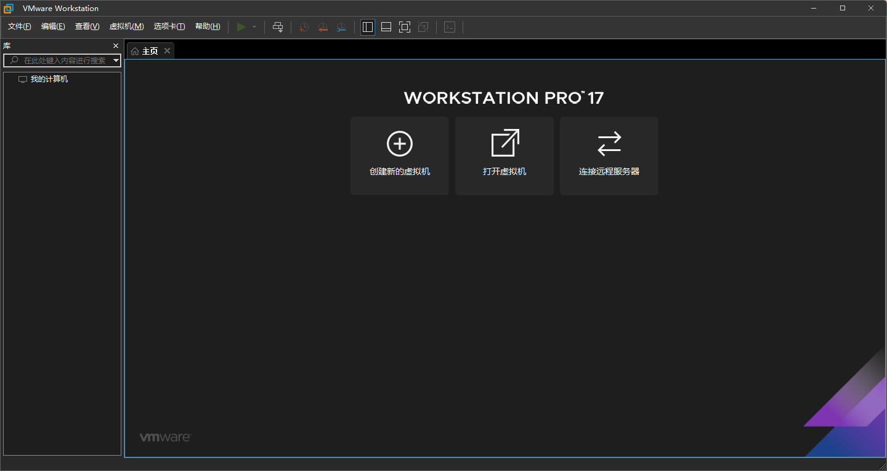

