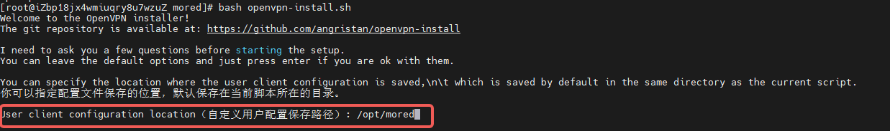
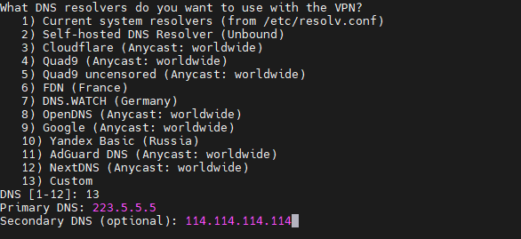
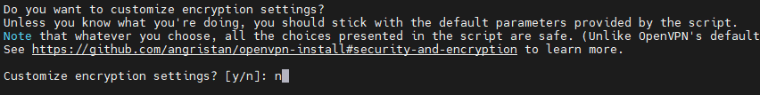
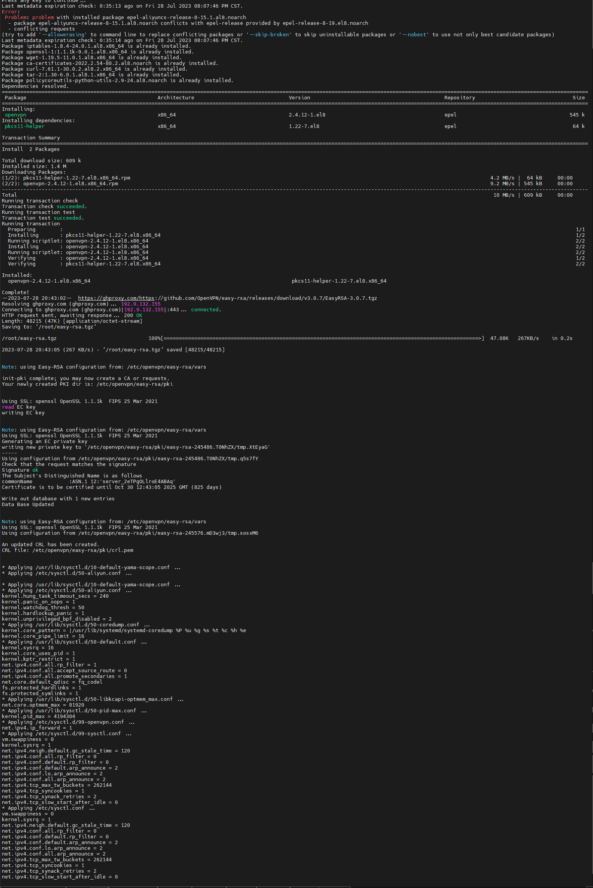
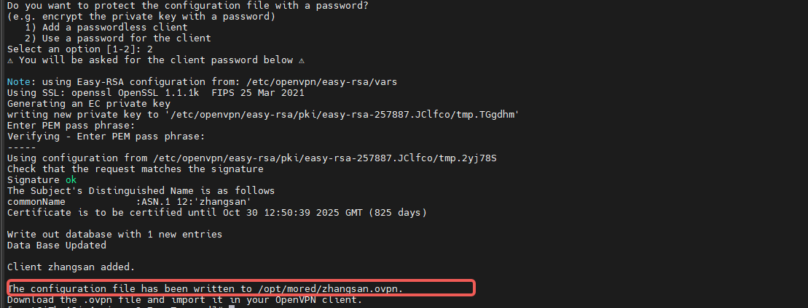

# Linux下脚本一键安装OpenVPN

[toc]

## 前言

在很早之前我介绍过[什么是OpenVPN](../05/D02-%E4%BB%80%E4%B9%88%E6%98%AFOpenVPN.md)，但是一直没有总结如何安装，主要是在捣鼓有没有简单的方法能够安装`OpenVPN`，这个有时候需要看机遇，一个月前搜索的结果和今天搜索的结果看到的内容是不一样的。

## 脚本介绍

这是`Github`开源一个非常热门（star数量和fork数量）的`OpenVPN`安装器，支持`Debian`、 `Ubuntu`、 `Fedora`、 `CentOS`、 `Arch Linux`、 `Oracle Linux`、 `Rocky Linux` 和 `AlmaLinux`。

`Github`地址：`https://github.com/angristan/openvpn-install`

## 我的改造

* 移植到`Gitee`，方便下载
* 支持阿里云的Linux
* `EasyRSA`无法下载的问题
* 用户配置文件自定义
* 创建用户引导配置证书密码

`Gitee`地址：`https://gitee.com/mzllon/openvpn-install/tags`

## 环境准备

* 一台Linux系统：我这里是阿里云Linux
* 公网IP
* 确定端口：默认OpenVPN端口采用`1194`
* 云厂商开放端口：如阿里云在安全组配置入方向

## 下载项目

如果系统已经安装了`Git`软件，可以通过`Git`拉取代码。

如果没有`Git`软件可以直接下载`https://gitee.com/mzllon/openvpn-install/repository/archive/v20230728`，不过这个需要系统安装`unzip`软件，不然无法解压。

假设我们的所有操作都在这个目录下`/opt/openvpn`。

### Git方式

```sh
mkdir -p /opt/openvpn && cd /opt/openvpn
git clone https://github.com/angristan/openvpn-install --depth 1
cd openvpn-install && ls -lrth
bash ./openvpn-install.sh
```

### HTTP方式

```sh
dnf install unzip wget -y
mkdir -p /opt/openvpn && cd /opt/openvpn
wget -O ./openvpn-install.zip https://gitee.com/mzllon/openvpn-install/repository/archive/v20230728
unzip openvpn-install.zip && cd openvpn-install && ls -lrth
bash ./openvpn-install.sh
```

## 安装过程

0. 启动安装

    ```sh
    bash openvpn-install.sh
    ```

1. 用户配置文件保存路径

    默认是当前路径，可以自定义更改。

    

2. 公网IPv4探测

    默认探测到的内网IP地址，不用担心，脚本能够识别出这是内网IP地址。

    

3. 探测真实的公网`IPv4`

    这里脚本一般能够探测到真实的`IPv4`地址，如果还是不正确话，可以手动修改。

    

4. 是否要启用`IPv6`

    这个一般不需要，`IPv6`离真正全面使用还早。**默认就是不用IPv6**

    

5. OpenVPN需要监听的端口

    默认的端口是`1194`，也可以自定义修改。

    

6. 协议选择

    默认推荐的协议是`udp`，支持`tcp`协议。

    

7. DNS设置

    提供都是国外的DNS服务器，所以这里选择`13`，也就是自定义DNS配置。然后要求输入主DNS和备DNS，其中主DNS是必须输入的，而备DNS是可选的。我这里分别采用了`223.5.5.5`（阿里云）和`114.114.114.114`（电信）。

    

8. 是否启用压缩

    默认不启用，因为启用压缩有风险。

    

9. 自定义证书配置

    我们知道`OpenVPN`在传输过程中是加密的，我们采用脚本提供的默认证书生成规则就可以了，除非自己对证书各项配置非常清楚。

    

10. 准备就绪

    经过这些的安装前的配置工作，按任意键就自动安装了。

    

11. 安装过程中

    

12. 创建第一个用户

    `OpenVPN`安装成功之后，提示创建一个用户，用户名格式必须为英文字母、下划线和横杆。

    

13. 是否配置证书密码

    这里我调整了脚本，默认要求配置证书密码，这样提高安全性。

    

14. 下载配置文件分发

    将刚刚创建的用户配置文件`zhangsan.ovpn`下载分发对应的同学。

至此安装过程完成。

## 用户新增与删除

非常简单，再次执行`bash openvpn-install.sh`即可。

## 总结

总体来说这个脚本已经给我们省了很多事情，我只是在上面做了一些微小的调整。

