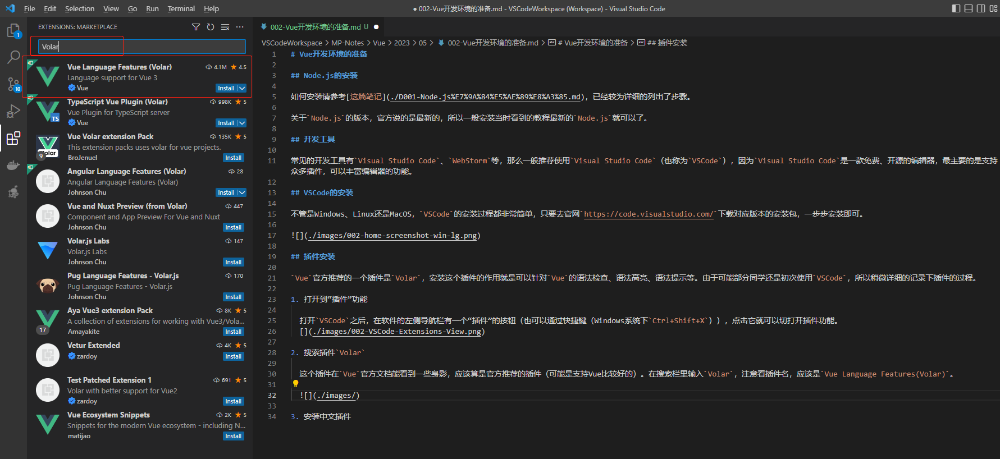
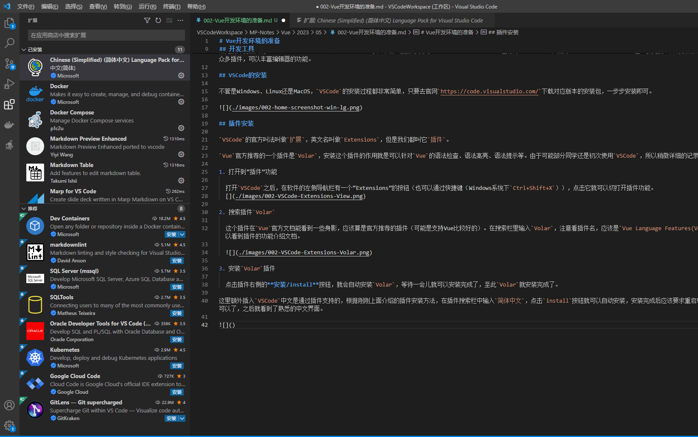

# Vue开发环境的准备

[toc]

## Node.js的安装

如何安装请参考[这篇笔记](./D001-Node.js%E7%9A%84%E5%AE%89%E8%A3%85.md)，已经较为详细的列出了步骤。

关于`Node.js`的版本，官方说的是最新的，所以一般安装当时看到的教程最新的`Node.js`就可以了。

## 开发工具

常见的开发工具有`Visual Studio Code`、`WebStorm`等，那么一般推荐使用`Visual Studio Code`（也称为`VSCode`），因为`Visual Studio Code`是一款免费、开源的编辑器，最主要的是支持众多插件，可以丰富编辑器的功能。

## VSCode的安装

不管是Windows、Linux还是MacOS，`VSCode`的安装过程都非常简单，只要去官网`https://code.visualstudio.com/`下载对应版本的安装包，一步步安装即可。

## 插件安装

`VSCode`的官方叫法叫做`扩展`，英文名叫做`Extensions`，但是我们都叫它`插件`。

`Vue`官方推荐的一个插件是`Volar`，安装这个插件的作用就是可以针对`Vue`的语法检查、语法高亮、语法提示等。由于可能部分同学还是初次使用`VSCode`，所以稍微详细的记录下插件的过程。

1. 打开到“插件”功能

  打开`VSCode`之后，在软件的左侧导航栏有一个“Extensions”的按钮（也可以通过快捷键（Windows系统下`Ctrl+Shift+X`）），点击它就可以切打开插件功能。
  
  

2. 搜索插件`Volar`

  这个插件在`Vue`官方文档能看到一些身影，应该算是官方推荐的插件（可能是支持Vue比较好的）。在搜索栏里输入`Volar`，注意看插件名，应该是`Vue Language Features(Volar)`。点击插件可以看到插件的功能介绍文档。

  

3. 安装`Volar`插件

  点击插件右侧的**安装/install**按钮，就会自动安装`Volar`，等待一会儿就可以安装完成了，至此`Volar`就安装完成了。

这里额外插入`VSCode`中文是通过插件支持的，根据刚刚上面介绍的插件安装方法，在插件搜索栏中输入`简体中文`，点击`install`按钮就可以自动安装，安装完成后应该要求重启软件的，照着操作就可以了，之后就看到了熟悉的中文界面。

