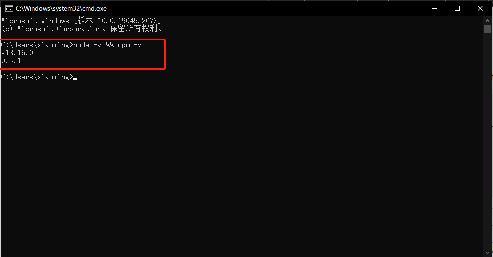

# Node.js的安装

[toc]

主要针对Windows、Alma Linux和MacOS三大平台的一个安装笔记。

## Windows

### 1、安装

1. 打开`Node.js`官网下载页面(https://nodejs.org/en/download)，点击下载按钮下载`Windows`版本的安装程序。
2. 双击下载的安装程序并按照提示进行安装。

### 2、配置

1. 安装完成后，`Node.js`会默认将可执行文件添加到环境变量`PATH`中，可以在命令行中直接使用。
2. 打开CMD或Windows PowerShell工具，输入`node -v`能看到输出信息即可。

  

## Alma Linux 8

### 方式1 - 在线安装

1. 打开终端并使用 root 用户登录。
2. 输入以下命令安装 Node.js：

  ```bash
  dnf install nodejs
  ```

3. 如果您需要安装特定版本的 Node.js，可以使用以下命令：

  ```bash
  dnf module list nodejs
  dnf module install nodejs:<version>
  ```

### 方式2 - 离线安装

1. 打开`Node.js`官网下载页面(https://nodejs.org/en/download)，点击下载按钮下载`Linux`版本的安装程序。
2. 将下载的离线安装包解压缩到指定目录。可以使用以下命令：

  ```bash
  tar xvf node-v18.16.0-linux-x64.tar.xz -C /data/nodesjs
  ```
  注意，这里使用的是`Node.js`版本`v18.16.0`，具体版本号需根据实际情况进行替换。

3. 配置环境变量。将以下命令添加到`/etc/profile`文件中，使其全局生效。

  ```bash
  export PATH=/data/nodejs/node-v18.16.0-linux-x64/bin:$PATH
  ```
  然后再执行命令`source /etc/profile`就可以生效了。
4. 验证`Node.js`是否安装成功。可以使用以下命令验证`Node.js`和`npm`的版本：

  ```sh
  node -v
  npm -v
  ```

  如果输出版本号，则说明安装成功。

## MacOS

### 1、安装

1. 打开`Node.js`官网下载页面(https://nodejs.org/en/download)，点击下载按钮下载`MacOS`版本的安装程序。
2. 双击下载的安装程序并按照提示进行安装。

### 2、配置

安装完成后，`Node.js`会默认将可执行文件添加到环境变量`PATH`中，可以在终端中直接使用。

## 针对国内的优化

### 镜像源

由于`Node.js`的官方源在国内访问速度较慢，可以使用国内的镜像源来加速下载和安装。

以下是一些常用的`Node.js`镜像源：

* 淘宝NPM镜像：`https://registry.npm.taobao.org/`
* cnpmjs 镜像：`https://r.cnpmjs.org/`
* 阿里云Node.js镜像：`http://mirrors.aliyun.com/node/`
华为云Node.js镜像：`https://mirrors.huaweicloud.com/nodejs/`
清华大学Node.js镜像：`https://mirrors.tuna.tsinghua.edu.cn/nodejs-release/`

### 配置NPM镜像源

打开终端并输入以下命令，设置 NPM 的全局镜像源为淘宝 NPM 镜像：

```bash
npm config set registry https://registry.npm.taobao.org
```

## 其它

### cnpm

`cnpm`是淘宝团队开发的一个基于`npm`的包管理工具，其主要的功能就是将`npm`官方源的镜像切换成淘宝镜像源，这样就能够提高国内用户的安装速度。`cnpm`安装完毕后，所有使用`npm`安装模块的地方，都可以使用`cnpm`代替`npm`命令，让安装变得更加快速和稳定。

#### 安装

```bash
npm install -g cnpm --registry=https://registry.npm.taobao.org
```

### pnpm

`pnpm`是一个类似于`npm`和`yarn`的第三方包管理器，它能够管理项目中的依赖包，支持锁定版本、快速安装、并发执行等特性，可以有效地提高依赖包的安装速度和开发效率。

与`npm`和`yarn`不同的是，pnpm 会在本地共享依赖包，而不是像`npm`和`yarn`那样在每个项目中都安装一份依赖包。这样可以节省磁盘空间，减少重复的下载和安装，同时也能提高项目的构建速度。

#### 安装

在终端中执行以下命令就可以完成安装。

```bash
npm install -g pnpm
```

