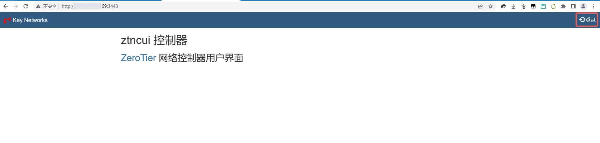
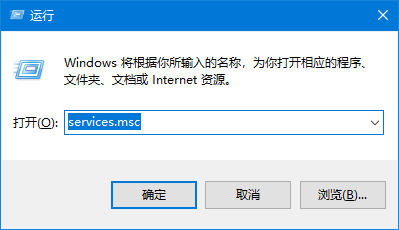

# ZeroTier自建Moon服务器，替换官方Planet

[toc]

## 回顾

`ZeroTier`是什么在前面的文章小明已经介绍了，我们这里就简单回顾下`Planet`、`Moon`、`Leaf`的概念和定义。

`Planet`代表星球，是`ZeroTier`官方提供的节点；而`Moon`自定义的`Planet`，主要是为了解决`Planet`节点有延迟的情况；`Leaf`是客户端，与`Moon`和`Planet`的区别是节点关系。

## 自建原因

* 海外节点偶有不稳定的情况（其实我还没碰到过）
* 突破25台的限制
* 提升性能

> 以我个人使用结果来看，其实如果对网络延迟性、无中断的较高要求，官方节点其实已经够了，可以省事而且免费啊。

## 实验环境

* 需要有Docker基础

  目前机器使用的Docker版本：`Docker version 23.0.4, build f480fb1`

* 需要有公网IP的服务器
* 安装Linux操作系统
  
  目前ECS安装的操作系统为`Alibaba Cloud Linux release 3 (Soaring Falcon)`，`CentOS 7 or 8`、`Alma Linux`都可以。

* 有一定的Linux命令基础，因为目前都是在Linux搭建`Moon`服务的（其实也可以在Windows下跑起来）。
* 需要SSH工具，小明用的是`MobaXterm`。

## 开始安装

### 前置工作

需要云服务器开放端口，操作系统如果默认启用了防火墙是无所谓的，通过Docker部署时容器占用了的端口默认会放行的，主要是云厂商还有一层防火墙，具体看自己是在哪个云厂商买的啦。

* `3443` 是`Moon` Web管理后台，类似于官方的用户个人后台。
* `9993` 是`Moon`服务本身的端口，客户端（`Leaf`）就是`9993`端口连接通信的。

在操作开放端口的时候，需要注意是这样的`3443/tcp`、`9993/tcp`、`9993/udp`。


其次确认自己的公网IP，因为在安装的时候脚本可能获取的IP是不正确的，一定要确认下。

### 下载项目

```bash
mkdir -p /opt/ztp && cd /opt/ztp
git clone https://gitee.com/mzllon/docker-zerotier-planet.git --depth 1
cd docker-zerotier-planet && ls -lrth
bash ./deploy.sh

```

登录服务器之后，将上面的命令复制粘贴就可以自动执行安装，然后会看到如下的一些输出

```bash
[root@xiaom ztp]# mkdir -p /opt/ztp && cd /opt/ztp
[root@xiaom ztp]# git clone https://gitee.com/mzllon/docker-zerotier-planet.git --depth 1
正克隆到 'docker-zerotier-planet'...
remote: Enumerating objects: 18, done.
remote: Counting objects: 100% (18/18), done.
remote: Compressing objects: 100% (17/17), done.
remote: Total 18 (delta 0), reused 13 (delta 0), pack-reused 0
展开对象中: 100% (18/18), 379.99 KiB | 922.00 KiB/s, 完成.
[root@xiaom ztp]# cd docker-zerotier-planet && ls -lrth
总用量 20K
-rw-r--r-- 1 root root 8.5K 6月  19 11:39 README.md
-rw-r--r-- 1 root root 3.0K 6月  19 11:39 Dockerfile
drwxr-xr-x 2 root root  172 6月  19 11:39 asserts
drwxr-xr-x 2 root root   59 6月  19 11:39 patch
-rwxr-xr-x 1 root root 1.1K 6月  19 11:39 deploy.sh
[root@xiaom docker-zerotier-planet]# bash ./deploy.sh
设置当前公网 IP，默认为：172.16.120.1 ： 8.8.8.8
你输入的IP为: 8.8.8.8，请自行检查IP是否正确！
使用公网 IP：8.8.8.8
清除原有内容
Error response from daemon: No such container: zerotier-planet
Error: No such container: zerotier-planet
Error: No such image: zerotier-planet
打包镜像
Sending build context to Docker daemon  904.2kB
Step 1/6 : FROM ubuntu:20.04
...
```

如果脚本自动识别出来的IP`172.16.120.1`不是机器的外网IP，那么需要手动输入下，比如这里输入的`8.8.8.8`（再次提醒`8.8.8.8`换成自己的公网IP哦）。

```bash
Error response from daemon: No such container: zerotier-planet
Error: No such container: zerotier-planet
Error: No such image: zerotier-planet
```

上面的这些错误提示没有关系的，不必但系。

整个脚本预计需要 3-10 分钟,具体需要看网络与机型，当您看到类似如下字样时，表示安装成功：

```bash
Step 6/6 : CMD /bin/sh -c "zerotier-one -d; cd /opt/ztncui/src;npm start"
 ---> Running in 13b4acf043ce
Removing intermediate container 13b4acf043ce
 ---> f66b3f73437e
Successfully built f66b3f73437e
Successfully tagged zerotier-planet:latest
启动服务
WARNING: Published ports are discarded when using host network mode
7782066b89fb217bf53ae57b139c73c3d6df79fecf887d1571aa8eed2433ba75
```

### 下载`planet`文件

脚本运行完成后，会在`/opt/ztp/docker-zerotier-planet/`目录下有个`planet`文件，用`MobaXterm`下载该文件以备用。

## 管理后台的简单使用（创建网络）

### 登录并改密码

打开浏览器输入`http://ip:3443`，其中`ip`改为自己的公网地址，就会进入管理页面，在页面的右上角有一个登录，点击这个按钮。



使用默认账号`admin`，默认密码`password`登录，第一次使用会跳转到修改密码页面，**强烈建议修改密码，而且密码复杂高一点，不然默认的账密太危险了。**

### 创建网络

默认情况下没有网络（简单理解网络指的是一个虚拟的路由器）的，需要我们添加一个：


网络名称的值自己想一个，就是相当于取了一个别名：


创建网络成功之后，就会看到网络信息，最重要的是会得到一个网络ID：


## 客户端配置

客户端主要为Windows、Linux、MacOS、Android。

### Windows客户端

首先我们要去`zerotier`官网下载一个`zerotier`客户端，Windows 7的请下载`https://download.zerotier.com/RELEASES/1.6.6/dist/ZeroTier%20One.msi`，Windows 8及其以上的系统请下载`https://download.zerotier.com/dist/ZeroTier%20One.msi`。

如果大家无法访问这个地址，我已经搬运了，就麻烦大家关注下我的公众号哈，然后私信回复`zt`。


#### 安装过程

Windows下如何安装`ZeroTier`这里不展开了，安装的过程中需要安装一个驱动（虚拟网卡），这个必须要同意，不然没法玩了。

#### 替换配置

将`planet`文件覆盖粘贴到`C:\ProgramData\ZeroTier\One`中，这个目录是个隐藏目录，可以通过运行中快速打开。

1. 按`Win + R`组合键，可以快速打开【运行】窗口：

 

2. 粘贴或输入`C:\ProgramData\ZeroTier\One`，然按回车键或点击【确定】按钮就可以打开这个隐藏目录了。

 

3. 将下载的`planet`文件替换

4. 打开Windows服务，再次打开【运行】窗口，然后输入`services.msc`后按回车键或点击【确定】按钮。

  

5. 找到`ZeroTier One`服务，在英文输入法状态下，直接按`z`就可以快速定位到该服务名。

  

6. 重启该服务，选中`ZeroTier One`之后，点击左上角的`重启动此服务`即可。**（如果重启失败，直接点击启动此服务就可以，没有影响的）**

  

7. 加入网络

  说的简单点就是客户端脸上虚拟路由器，加入网络有两种操作方式，下面分别介绍下：
  * 通过图形界面加入

    `ZeroTier`安装完成之后就自动打开该软件，只是该软件没有操作页面，但是`ZeroTier`有一个托盘图标：

    

    找到这个图标后，鼠标单击它就会弹出一个菜单列表，点击【Join New Network...】

    

    在弹出的对话框中，输入我们前面创建网络获得的网络ID，然后点击【Join】按钮即可：

    

  * 通过命令行加入

    必须用管理员权限打开命令行工具，鼠标点击系统的开始，在弹出的页面中，输入`cmd`：

    

    鼠标右键【命令提示符】，在弹出的菜单中点击【以管理员运行】：

    

    在命令提示符窗口输入` zerotier-cli.bat join 网络id`后按回车键：

    

    如果看到下面的提示就表示加入成功了。

    ```cmd
    C:\Windows\system32> zerotier-cli.bat join 网络id(就是在网页里面创建的那个网络)
    200 join OK
    C:\Windows\system32>
    ```
8. 管理后台同意加入

  

### Linux客户端

这里介绍两种方式，Linux直接安装和Docker安装，个人比较愿意使用Docker，这样相对比较干净。

### Linux直接安装

基于`Debian`和`RPM`的发行版，包括`Debian`、`Ubuntu`、`CentOS`、`RHEL`、`Fedora`等。

1. `root`用户登录Linux系统，输入下面的命令即可一键安装。

  ```bash
  curl -s https://install.zerotier.com | sudo bash
  ```
  
2. 进入目录`/var/lib/zerotier-one`
3. 替换目录下的`planet`文件
4. 重启`zerotier-one`服务

  老的Linux系统用命令`service zerotier-one restart`重启服务，新的Linux系统用命令`systemctl restart zerotier-one`重启服务。

5. 加入网络

  输入命令`zerotier-cli join 网络id`就可以了。

6. 管理后台同意加入请求
7. 通过命令`zerotier-cli peers`就可以查看节点信息。

### Docker方式安装

要求前提必须安装了`Docker`和`Docker-Compose`，假设配置文件的目录在`/opt/zt-docker`。

1. 准备目录

  ```bash
  mkdir -p /data/zt-docker/data && cd /data/zt-docker
  ```

2. 编辑编排文件`docker-compose.yaml`

  ```yaml
  version: '3.3'
  services:
    zerotier:
      container_name: zerotier-one
      devices:
        - /dev/net/tun
      privileged: true
      image: zerotier/zerotier:1.10.6
      network_mode: host
      cap_add:
        - NET_ADMIN
        - SYS_ADMIN
      command: ['网络ID']
      volumes:
        - ./data:/var/lib/zerotier-one
  ```

3. 替换网络ID
4. 上传`planet`文件到`./data`
5. 运行命令下载并启动

  ```bash
  docker-compose up -d
  ```
6. 管理后台同意加入请求
7. 通过命令查看是否分配到了IP地址

  ```bash
  ip -4 a|grep zt
  ```
  
  正常情况下能看到如下的信息输出的。

  ```bash
  [root@dev-web01 zerotier]# ip -4 a|grep zt
  67: ztrh4ofn7p: <BROADCAST,MULTICAST,UP,LOWER_UP> mtu 2800 qdisc fq_codel state UNKNOWN group default qlen 1000
    inet 10.145.50.180/24 brd 10.145.50.255 scope global ztrh4ofn7p
  ```

### Android客户端

网友开发的，我自己没安装过，因为没这个需求，如果玩NAS的同学们可能有需求。

`https://github.com/kaaass/ZerotierFix`。

### MacOS

`Mac OS`正常来说有三种方式的安装，官方提供的安装程序`ZeroTier-One.pkg`，官方的一键安装脚本（实际也是安装`ZeroTier-One.pkg`）和Docker。这里简单摘录下程序安装配置：

1. 安装`ZeroTier-One.pkg`
2. 进入`/Library/Application\ Support/ZeroTier/One/`目录，并替换目录下的`planet`文件
3. 重启`ZeroTier-One`

  ```bash
  cat /Library/Application\ Support/ZeroTier/One/zerotier-one.pid | sudo xargs kill
  ```

4. 加入网络

  ```bash
  zerotier-cli join 网络 id
  ```

5. 管理后台同意加入请求
6. 查看`planet`角色

  ```bash
  zerotier-cli peers
  ```

## 既是Moon又是Leaf

这个的意思就是说具有公网地址的服务器既充当了`Moon`服务器角色，同时又是客户端角色，因为我们首先要知道的一个点是Moon只保存各个客户端（节点）的信息，客户端无法看到（`ping`）Moon的，所以为了让这台公网地址的服务器和其它机器互通，需要在安装下`ZeroTier-One`客户端。公网地址服务器和其它机器互通之后，我们可以做很多其它事情。

我这里介绍下Docker方式的安装，`Moon`和`Leaf`都会占用`9993`端口，需要更改下`Leaf`的端口即可，其它跟前面的安装方式一样，只不过多了一个配置文件。

新建一个文件`local.conf`保存到`./data`目录下，其内容为：

```conf
{
  "settings": {
    "primaryPort": 9994
  }
}
```

我这里将`Leaf`的端口改为了`9994`。

其它的操作跟Docker方式安装没有任何区别了。

## 常见问题

1. Q：为什么ping不通目标IP机器？

    A：请检查防火墙设置，`Windows`系统需要允许`ICMP`入站，`Linux`同理。

2. Q：iOS客户端怎么用？

    A：iOS 客户端插件在这里，设备需要越狱： https://github.com/lemon4ex/ZeroTieriOSFix

3. Q: 为什么看不到官方的`Planet`

    A: 该项目剔除了官方服务器，只保留了自定义的`Planet`节点

4. Q：我更换了IP需要怎么处理？

    A: 如果IP更换了，则需要重新部署，相当于全新部署。如果后面有这种需求的话，我可以尝试修改脚本，支持更换IP即可。

5. Q：可以加入多个网络么？

    A：可以新建多个网络并加入，但是由于我们是定制了Planet，所以你无法加入别人的ZeroTier。**如果是Docker安装的话，可以解决这个问题。**

## 致谢

* https://www.zerotier.com/
* https://github.com/zerotier/ZeroTierOne
* https://gitee.com/shiruixuan/docker-zerotier-planet
